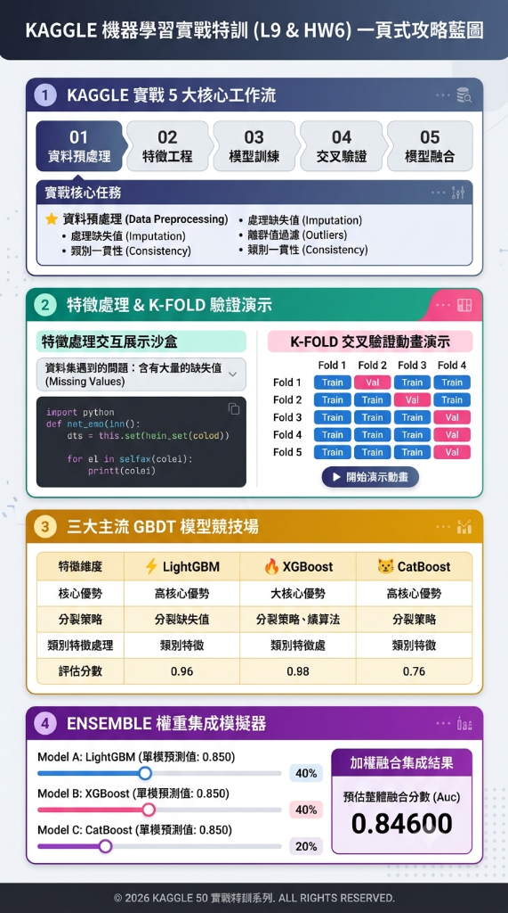

# 50 Startups Profit Prediction 🚀

A machine learning project following the **CRISP-DM** methodology to predict startup profit based on R&D, Administration, and Marketing expenditures across different states.

---

## 🌐 線上預覽 | Live Demo

*   **Interactive Web Application (Streamlit)**:  
    🔗 **[Live Demo 網頁預估模型](https://cloudportfolio-khibgwiuagecuxc8gukdpm.streamlit.app/)**

*   **HTML Presentation Slides (GitHub Pages)**:  
    🔗 **[Presentation Slides 專案簡報](https://asia17242.github.io/Cloud_Portfolio/projects/50_Startups_Profit_Prediction/index.html)**

---

## 🗺️ Kaggle ML Workflow Infographic | Kaggle 機器學習實戰特訓一頁式攻略藍圖



---

## 📊 Project Overview

| Aspect | Detail |
|--------|--------|
| **Objective** | Predict startup profit and identify key budget drivers |
| **Dataset** | Kaggle 50 Startups (50 records, 5 features) |
| **Methodology** | CRISP-DM (Cross-Industry Standard Process for Data Mining) |
| **Best Model** | **Ridge Regression (alpha=1.0)** |
| **Robust Validation** | **5-Fold Cross-Validation** |
| **5-Fold CV R²** | **0.9326** (+/- 0.0420) |
| **MAE / RMSE (CV)** | **$7,976** / **$10,436** |

---

## ✨ Features | 專案亮點

*   **Standardized Coefficients**: Features are standardized using `StandardScaler` to ensure the coefficients directly and fairly represent feature importance.
*   **Multicollinearity Diagnostics**: Integrated Variance Inflation Factor (VIF) checks to examine the collinearity between R&D and Marketing spend.
*   **Cross-Validation & Regularization**: Introduces 5-Fold CV and L2 regularization (Ridge) to mitigate overfitting given the small sample size ($N=50$).
*   **Bilingual Dashboard Switcher**: The interactive dashboard supports toggling between **English** and **繁體中文** dynamically.
*   **Operational Business Metrics**: Translates machine learning metrics ($R^2$, MAE) into financial impacts for CFOs and investors.
*   **Interactive Simulations**:
    *   *Feature Contribution waterfall/bar charts* showing the positive/negative marginal impact of each budget department.
    *   *Budget Allocation pie charts* depicting current expense ratios.
    *   *What-If Sensitivity Analysis line charts* demonstrating predicted profits against varying R&D budgets.

---

## 📁 Project Structure

```
50_Startups_Profit_Prediction/
├── data/
│   └── 50_Startups.csv          # Original dataset (50 samples)
├── notebooks/
│   └── EDA.ipynb                 # Jupyter Notebook with full CRISP-DM analysis
├── src/
│   └── eda.py                    # Data preparation, VIF check, and model comparison script
├── assets/                       # Statically generated EDA and evaluation charts
├── app.py                        # Bilingual Streamlit interactive dashboard
├── index.html                    # Presentation slides (HTML/CSS)
├── requirements.txt              # Project dependencies
├── edited-image.png              # Kaggle ML Workflow Infographic
├── 50SPP.md                      # Complete executive project report (CRISP-DM documentation)
└── README.md                     # Project documentation
```

---

## 🛠️ Tech Stack

*   **Data Analysis & Modeling**: Python, Pandas, NumPy, Scikit-Learn, Statsmodels, SciPy
*   **Interactive Dashboard**: Streamlit
*   **Visualization**: Plotly Express, Plotly Graph Objects, Matplotlib, Seaborn
*   **Deployment**: Streamlit Community Cloud, GitHub Pages

---

## 🚀 Getting Started

### Installation

Clone the repository and install dependencies:
```bash
git clone https://github.com/asia17242/Cloud_Portfolio.git
cd Cloud_Portfolio/projects/50_Startups_Profit_Prediction
pip install -r requirements.txt
```

### Run Model Analytics & Training

Execute the script to perform descriptive analysis, multicollinearity VIF tests, K-Fold cross-validation, and generate static visualization plots:
```bash
python src/eda.py
```

### Run Streamlit Locally

Start the local web application:
```bash
streamlit run app.py
```

---

## 💡 Key Business Insights

1.  **R&D Spend** is the primary profit driver (standardized coefficient **+$33,497**). Every $1 standard deviation increase in R&D spend yields highest ROI.
2.  **Marketing Spend** is the secondary driver (standardized coefficient **+$7,602**).
3.  **Administration** expenses have negligible or slightly negative correlation to profit (**-$1,268**). Administrative costs should be controlled.
4.  **State Location** (Florida, New York vs. California) has minimal effect (<3% variance) on company profit.
