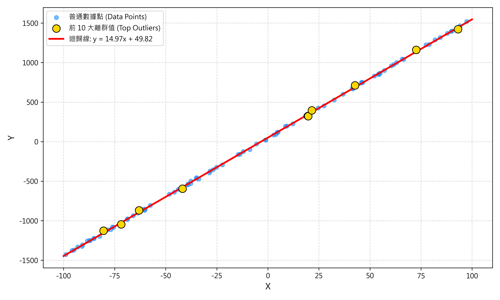

# 📊 線性迴歸模擬與離群值偵測系統 (Homework 04)

這是一個基於 **Streamlit** 與 **Scikit-Learn** 開發的互動式 Web 應用程式，專門用於模擬線性迴歸分析並動態偵測離群值（Outliers）。本專案實踐了 CRISP-DM 數據探勘方法論中的**模型建立（Modeling）**與**模型評估（Evaluation）**階段。

---

## 🌐 線上展示 (Live Demo)

[](https://share.streamlit.io/asia17242/homework_04/main/app.py)

🚀 **[點此進入 Live Demo 網頁](https://share.streamlit.io/asia17242/homework_04/main/app.py)**

---

## 📈 迴歸模型與數據分佈圖 (Preview)



---

## 🛠️ 功能特點

1. **互動式參數控制面板 (🎛️ Control Panel)**
   - **數據點數量 ($n$)**：支援 15 至 500 個點的動態調整。
   - **真實斜率 ($a$)**：可設定 $-50.0$ 至 $50.0$ 的真實斜率。
   - **真實截距 ($b$)**：可設定 $0.0$ 至 $100.0$ 的真實截距。
   - **雜訊變異數 ($var$)**：調整隨機常態分佈雜訊的變異程度（$0.0$ 至 $300.0$）。
   - **固定隨機種子 (Set Seed)**：固定結果以便於實驗比對。

2. **動態數據生成與迴歸擬合**
   - 依據公式 $y = a \cdot x + b + \epsilon$ 自動生成數據（其中雜訊 $\epsilon \sim N(0, \sqrt{var})$）。
   - 自動進行最小平方法（OLS）線性迴歸擬合，估算預測的斜率、截距以及 $R^2$ 決定係數。

3. **自動離群值偵測 (Outlier Detection)**
   - 計算所有數據點的絕對殘差（Residuals，即預測值與實際值的絕對誤差）。
   - 自動篩選並標記前 10 大絕對殘差的離群值點。

4. **直觀的視覺化呈現**
   - **左側圖表**：使用 Matplotlib 繪製散佈圖、鮮紅色的迴歸線，並以**金黃色放大圓圈**標記離群值。
   - **右側數據**：顯示真實參數與估計參數的對比（包含誤差增量），以及前 10 大離群值的詳細 X 座標、實際 Y 座標及殘差大小。

---

## 📁 專案結構

```text
projects/Homework_04/
├── app.py          # Streamlit 主程式
└── README.md       # 說明文件
```

---

## 🚀 本地運行指南

若您想在本地環境運行此專案，請按照以下步驟操作：

### 1. 安裝必要套件
請確保已安裝 Python 3.8+，並執行以下指令安裝依賴項目：
```bash
pip install streamlit numpy pandas matplotlib scikit-learn
```

### 2. 啟動 Streamlit 服務
```bash
streamlit run app.py
```
啟動後，瀏覽器將會自動開啟 `http://localhost:8501` 展示本系統。

---

## 🧮 數學公式與 CRISP-DM 關聯

* **模型建立**：利用 `sklearn.linear_model.LinearRegression` 求解：
  $$\hat{y} = \hat{a}x + \hat{b}$$
* **模型評估**：計算殘差以評估擬合效果並找出極端值：
  $$\text{Residual}_i = |y_i - \hat{y}_i|$$
  以及評估模型解釋力的決定係數：
  $$R^2 = 1 - \frac{\sum (y_i - \hat{y}_i)^2}{\sum (y_i - \bar{y})^2}$$

---

## 📬 聯絡作者
* GitHub: [@asia17242](https://github.com/asia17242)
* 作品集主頁: [Cloud Tsai Portfolio](https://asia17242.github.io/Cloud_Portfolio/)
