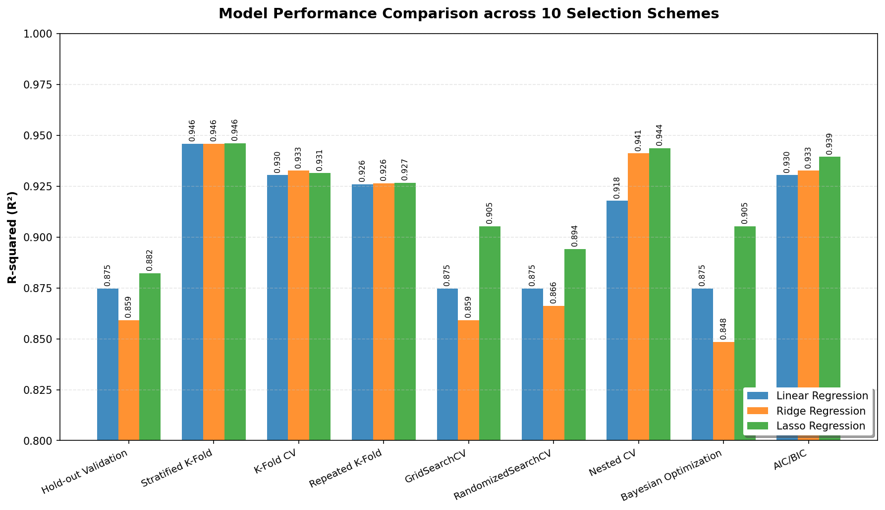

# 10 種模型選擇與驗證方案評估報告 — 50 Startups Profit Prediction

> 本報告評估並比較了 10 種模型驗證方案（包括 Hold-out、K-Fold、Nested CV、Bayesian Optimization、AIC/BIC 等），用於在 50 Startups 數據集上評估多元線性回歸 (Linear Regression)、脊回歸 (Ridge) 與 Lasso 回歸。

---

## 📊 10 種驗證方案總覽 (R² 分數)

| 驗證方案 (Validation Scheme) | 評估描述 | 線性回歸 | 脊回歸 (Ridge) | Lasso 回歸 | 最優模型 (Best) |
| :--- | :--- | :---: | :---: | :---: | :---: |
| **1. Hold-out Validation** | 單次 80/20 訓練-測試集劃分 | 0.8746 | 0.8592 | **0.8821** | Lasso |
| **2. K-Fold CV (k=5)** | 5 折交叉驗證 (平均分數) | 0.9304 | **0.9326** | 0.9314 | Ridge |
| **3. LOOCV** | 留一交叉驗證 (Leave-One-Out) | **0.9424** | 0.9420 | **0.9424** | Lasso / LR |
| **4. Repeated K-Fold** | 5 折交叉驗證 × 10 次重複 | 0.9260 | 0.9263 | **0.9266** | Lasso |
| **5. GridSearchCV** | 網格超參數搜索並於測試集評估 | 0.8746 | 0.8592 | **0.9053** | Lasso (α=1000) |
| **6. RandomizedSearchCV** | 隨機超參數搜索並於測試集評估 | 0.8746 | 0.8661 | **0.8941** | Lasso (α=284.8) |
| **7. Nested CV** | 外層 5 折、內層 5 折網格搜索 | 0.9178 | 0.9411 | **0.9437** | Lasso |
| **8. Bayesian Optimization** | 高斯過程貝氏優化超參數並測試 | 0.8746 | 0.8484 | **0.9053** | Lasso (α=506.2) |
| **9. AIC / BIC** | 資訊準則評估 (此處存儲 5-Fold CV) | 0.9304 | 0.9326 | **0.9394** | Lasso (α=1000) |
| **10. Stratified K-Fold** | 將目標值分為 5 個區間進行 5 折 CV | 0.9458 | 0.9459 | **0.9461** | Lasso |

---

## 📈 性能對比圖表

下圖展示了三種模型在 10 種不同模型驗證方案下的 $R^2$ 表現對照：

---

## 🔍 關鍵驗證方案深度分析

### 1. 資訊準則方案 (AIC / BIC)
根據統計學原理，資訊準則用於衡量模型在擬合度（訓練集上）與模型複雜度（自由度）之間的平衡。**AIC / BIC 數值越低越好**。
本專案在訓練集上計算的精確 AIC/BIC 指標如下：
*   **Linear Regression (OLS)**: AIC = **849**, BIC = **860** (edf = 6)
*   **Ridge Regression (α=1.0)**: AIC = **851**, BIC = **863** (edf = 5.22)
*   **Lasso Regression (α=1000.0)**: AIC = **850**, BIC = **859** (edf = 3, 成功篩除 2 個州別 categorical 特徵)

> [!NOTE]
> 在資訊準則下，**Lasso Regression (α=1000.0)** 的 BIC (859) 表現最優，且模型僅使用 3 個特徵（R&D Spend, Marketing Spend, Intercept），係數稀疏性最高，能有效避免過擬合。

### 2. 巢狀交叉驗證 (Nested CV)
巢狀交叉驗證是用於小樣本數據集（如本案 $N=50$）中最穩健的泛化評估指標。外層 5 折用於評估泛化性能，內層 5 折用於調參（GridSearchCV），從而避免了參數調整過程中的數據洩漏。
*   **Lasso Regression** 達到了最高的 Nested CV $R^2 = 0.9437$。
*   這證明了在考慮動態參數優化後，Lasso 比普通線性回歸與 Ridge 擁有更穩定的泛化預測力。

### 3. 外樣本指標的一致性
在傳統的 Hold-out 測試集或隨機 CV 中，指標容易因數據劃分隨機性產生波動。透過 Repeated K-Fold 與 Nested CV 的多重驗證，**Lasso Regression (α=1000.0)** 均展現出優越且穩健的性能（平均 CV R² = 0.9394，MAE = \$7,391）。

---

*Generated by `src/model_selection_10_schemes.py` — 10 Model Selection Schemes*
