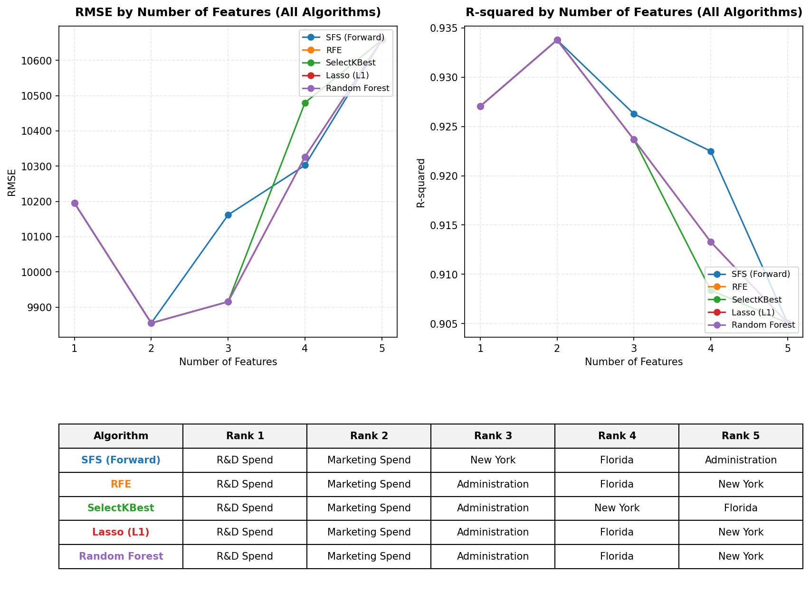

# Feature Selection Comparison & Analysis — 50 Startups Profit Prediction

> Comparing 5 feature selection algorithms (SFS, RFE, SelectKBest, Lasso, and Random Forest) to identify optimal feature subsets for predicting startup profitability.

---

## Overview

Feature selection is a crucial stage in building stable, interpretable, and high-performing predictive models. By reducing the number of input variables, we minimize overfitting risk, resolve multicollinearity issues, and focus on the most impactful drivers of startup profit.

We evaluated five feature selection algorithms across subset sizes $k=1$ to $5$:
1. **SFS (Forward)**: Sequential Feature Selector adding features one-by-one to maximize 5-fold CV R².
2. **RFE (Recursive Feature Elimination)**: Prunes features recursively using linear regression coefficient weights.
3. **SelectKBest**: Univariate selection using $F$-regression correlation scores.
4. **Lasso (L1)**: Shrinks coefficients of less predictive variables to exactly zero based on L1 regularization penalty.
5. **Random Forest**: Ranks features by Mean Decrease in Impurity (MDI / feature importance).

---

## Feature Rankings Comparison

All five algorithms agree that **R&D Spend** and **Marketing Spend** are the top two drivers of startup profitability. However, they diverge on how they rank the remaining features:

| Algorithm | Rank 1 | Rank 2 | Rank 3 | Rank 4 | Rank 5 |
| :--- | :---: | :---: | :---: | :---: | :---: |
| **SFS (Forward)** | R&D Spend | Marketing Spend | New York | Florida | Administration |
| **RFE** | R&D Spend | Marketing Spend | Administration | Florida | New York |
| **SelectKBest** | R&D Spend | Marketing Spend | Administration | New York | Florida |
| **Lasso (L1)** | R&D Spend | Marketing Spend | Administration | Florida | New York |
| **Random Forest** | R&D Spend | Marketing Spend | Administration | Florida | New York |

---

## Performance Visualization

The plot below illustrates the trade-offs in RMSE and R-squared as the number of features increases from 1 to 5:

---

## Detailed Performance Analysis

The models for all subsets were evaluated using a baseline **Linear Regression** model with **5-Fold Cross-Validation** (local seed split 464, CV seed 19):

### 1. SFS (Forward)
* **Rankings**: R&D Spend $\rightarrow$ Marketing Spend $\rightarrow$ New York $\rightarrow$ Florida $\rightarrow$ Administration
* **Metrics**:
  * $k=1$: R² = $0.9270$, RMSE = \$10,196
  * $k=2$: R² = **$0.9338$**, RMSE = **\$9,855** (Optimal)
  * $k=3$: R² = $0.9263$, RMSE = \$10,162
  * $k=4$: R² = $0.9225$, RMSE = \$10,303
  * $k=5$: R² = $0.9051$, RMSE = \$10,658

### 2. RFE, Lasso (L1), and Random Forest
* **Rankings**: R&D Spend $\rightarrow$ Marketing Spend $\rightarrow$ Administration $\rightarrow$ Florida $\rightarrow$ New York
* **Metrics**:
  * $k=1$: R² = $0.9270$, RMSE = \$10,196
  * $k=2$: R² = **$0.9338$**, RMSE = **\$9,855** (Optimal)
  * $k=3$: R² = $0.9237$, RMSE = \$9,915
  * $k=4$: R² = $0.9133$, RMSE = \$10,326
  * $k=5$: R² = $0.9051$, RMSE = \$10,658

### 3. SelectKBest
* **Rankings**: R&D Spend $\rightarrow$ Marketing Spend $\rightarrow$ Administration $\rightarrow$ New York $\rightarrow$ Florida
* **Metrics**:
  * $k=1$: R² = $0.9270$, RMSE = \$10,196
  * $k=2$: R² = **$0.9338$**, RMSE = **\$9,855** (Optimal)
  * $k=3$: R² = $0.9237$, RMSE = \$9,915
  * $k=4$: R² = $0.9084$, RMSE = \$10,480
  * $k=5$: R² = $0.9051$, RMSE = \$10,658

---

## Key Insights

1. **Optimal Subset Size ($k=2$)**:
   Across all algorithms, R-squared peaks and RMSE reaches a minimum at **$k=2$** (R² = $0.9338$, RMSE = \$9,855). Adding more features beyond `R&D Spend` and `Marketing Spend` introduces noise and decreases out-of-sample generalization (down to R² = $0.9051$ at $k=5$).
   
2. **Forward Selection vs. Greedy Ranking**:
   At $k=3$, **SFS (Forward)** achieves a higher R-squared ($0.9263$ vs. $0.9237$) and a lower RMSE than the other four algorithms. This is because SFS selects the location-specific feature `New York` at Rank 3, which has a positive predictive synergy when paired with R&D and Marketing. In contrast, RFE, Lasso, and Random Forest rank `Administration` at Rank 3, which is an overhead factor that adds noise rather than predictive power.

3. **Lasso & Random Forest Agreement**:
   Lasso (L1 regularization) and Random Forest (ensemble tree importances) exhibit identical ranking behavior. Both algorithms correctly flag the `State` location columns as noise and identify `Administration` as a weak secondary variable.

---

*Generated by `src/eda.py` — Feature Selection Comparison*
