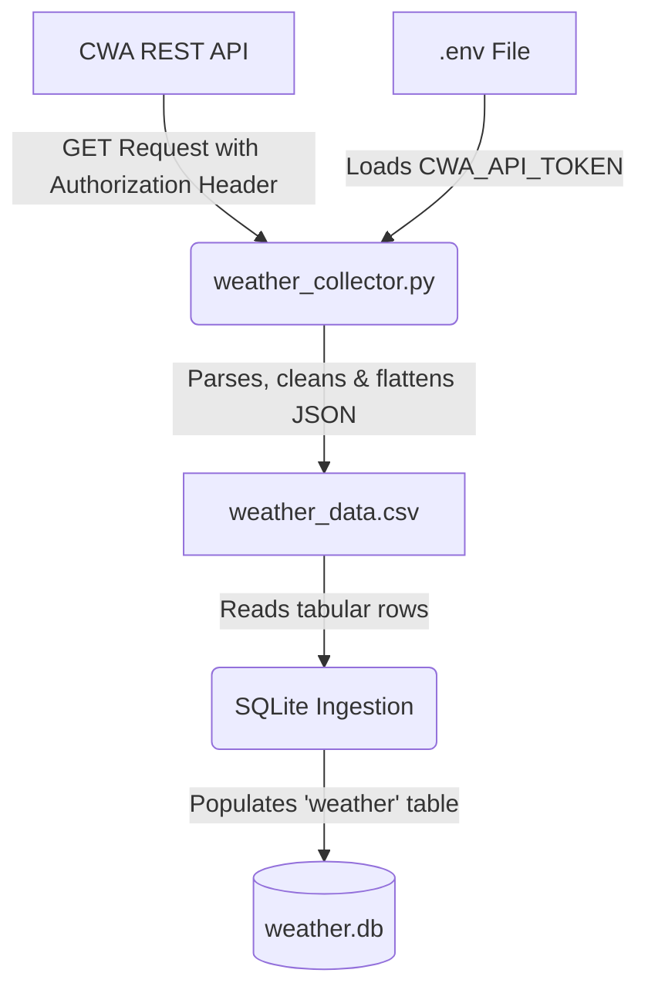

# Design Specification: CWA Weather Data Collector

This document describes the design, data architecture, and usage of the Central Weather Administration (CWA) weather data pipeline. The application fetches observations from Taiwan manned and unmanned weather stations, sanitizes and normalizes the attributes, exports them to a CSV format, and loads them into a local SQLite3 database.

---

## 1. System Data Flow

The collection pipeline runs as a single-stage process that pulls from the REST API endpoints and performs atomic CSV-to-Database synchronization.



---

## 2. Configuration & Authentication

To ensure security and keep credentials separated from source code, the system relies on environment variables:
* **Configuration File**: `.env` (located in the root directory).
* **Variable Key**: `CWA_API_TOKEN`.
* **Fallback & Safety**: If the variable is absent, the program aborts with a clear setup error, enforcing secure operations.

---

## 3. Data Processing & Normalization

Public CWA API datasets present nested parameters and use specific code values to denote invalid or missing measurements (e.g. equipment failure or temporary offline status). The pipeline cleanses these values before outputting to downstream databases:

### Missing Value Replacement Rules
* The following string patterns are mapped to Python `None` (written as empty cell in CSV, and loaded as `NULL` in SQL):
  `""`, `"-99"`, `"-99.0"`, `"-999"`, `"-999.0"`, `"-9999"`, `"-9999.0"`, `"-9991"`, `"-9992"`, `"-9995"`, `"-9996"`, `"-9997"`, `"-9998"`, `"None"`

### Location & Coordinate Extraction
* Each weather station returns a list of coordinates (e.g. `TWD67` and `WGS84`).
* The parser loops through coordinates to pull `WGS84` (global standard GPS) as primary, and `TWD67` (traditional Taiwan coordinate standard) as secondary fields, structuring them in clean float format.

---

## 4. SQLite3 Database Schema (`weather.db`)

The database contains a single table named `weather`. The schema maps the normalized data elements to their respective affinity type representation:

| Database Column | Data Type | Source Path (JSON Element) | Description |
| :--- | :--- | :--- | :--- |
| `station_id` | **TEXT PRIMARY KEY** | `StationId` | Unique station code identifier |
| `station_name` | **TEXT** | `StationName` | Name of the weather station |
| `obs_time` | **TEXT** | `ObsTime.DateTime` | ISO 8601 Observation datetime |
| `latitude_wgs84` | **REAL** | `Coordinates[WGS84].StationLatitude` | Latitude in WGS84 decimal degrees |
| `longitude_wgs84` | **REAL** | `Coordinates[WGS84].StationLongitude` | Longitude in WGS84 decimal degrees |
| `latitude_twd67` | **REAL** | `Coordinates[TWD67].StationLatitude` | Latitude in TWD67 decimal degrees |
| `longitude_twd67` | **REAL** | `Coordinates[TWD67].StationLongitude` | Longitude in TWD67 decimal degrees |
| `altitude` | **REAL** | `GeoInfo.StationAltitude` | Elevation of station (meters) |
| `county_name` | **TEXT** | `GeoInfo.CountyName` | County / City name |
| `town_name` | **TEXT** | `GeoInfo.TownName` | District / Township name |
| `county_code` | **TEXT** | `GeoInfo.CountyCode` | Admin county identifier code |
| `town_code` | **TEXT** | `GeoInfo.TownCode` | Admin town identifier code |
| `weather` | **TEXT** | `WeatherElement.Weather` | General weather state text (e.g.晴, 陰) |
| `visibility_description` | **TEXT** | `WeatherElement.VisibilityDescription` | Horizontal visibility (km) |
| `sunshine_duration` | **REAL** | `WeatherElement.SunshineDuration` | Hours of sunshine duration |
| `precipitation` | **REAL** | `WeatherElement.Now.Precipitation` | Current precipitation (mm) |
| `wind_direction` | **REAL** | `WeatherElement.WindDirection` | Wind direction (degrees) |
| `wind_speed` | **REAL** | `WeatherElement.WindSpeed` | Wind speed (m/s) |
| `air_temperature` | **REAL** | `WeatherElement.AirTemperature` | Temperature (°C) |
| `relative_humidity` | **REAL** | `WeatherElement.RelativeHumidity` | Relative humidity percentage (%) |
| `air_pressure` | **REAL** | `WeatherElement.AirPressure` | Atmospheric pressure (hPa) |
| `uv_index` | **REAL** | `WeatherElement.UVIndex` | Ultraviolet radiation level |
| `max_10min_wind_speed` | **REAL** | `WeatherElement.Max10MinAverage.WindSpeed` | Maximum 10-minute average wind speed |
| `max_10min_wind_direction`| **REAL** | `WeatherElement.Max10MinAverage.Occurred_at.WindDirection` | Direction of maximum average wind |
| `max_10min_wind_time` | **TEXT** | `WeatherElement.Max10MinAverage.Occurred_at.DateTime` | Timestamp of maximum average wind |
| `peak_gust_speed` | **REAL** | `WeatherElement.GustInfo.PeakGustSpeed` | Instantaneous peak gust wind speed (m/s) |
| `peak_gust_wind_direction`| **REAL** | `WeatherElement.GustInfo.Occurred_at.WindDirection` | Direction of peak gust wind |
| `peak_gust_time` | **TEXT** | `WeatherElement.GustInfo.Occurred_at.DateTime` | Timestamp of peak gust |
| `daily_high_temperature` | **REAL** | `WeatherElement.DailyExtreme.DailyHigh.TemperatureInfo.AirTemperature` | High temperature of the day |
| `daily_high_temperature_time`| **TEXT**| `WeatherElement.DailyExtreme.DailyHigh.TemperatureInfo.Occurred_at.DateTime`| Timestamp of daily high |
| `daily_low_temperature` | **REAL** | `WeatherElement.DailyExtreme.DailyLow.TemperatureInfo.AirTemperature` | Low temperature of the day |
| `daily_low_temperature_time` | **TEXT**| `WeatherElement.DailyExtreme.DailyLow.TemperatureInfo.Occurred_at.DateTime`| Timestamp of daily low |

---

## 5. Script Modules Structure

The collector is modularized inside a single execution script [weather_collector.py](file:///d:/Ai%20study/Cloud_Portfolio/projects/Homework_10_Open%20data/weather_collector.py):

* **Environment Setup**: `load_dotenv()` manually parses `.env` parameters to populate `os.environ`.
* **JSON Retrieval**: `fetch_json(url)` performs GET requests adding standard browser headers and the dynamic `Authorization` key.
* **Normalization Engine**: `parse_weather_data(json_data)` processes coordinate iterations and filters missing weather values.
* **Exporter**: `save_to_csv(records, filename)` builds a UTF-8-BOM CSV, keeping Chinese character descriptions readable in Microsoft Excel.
* **Loader**: `convert_csv_to_sqlite(csv_filename, db_filename, table_name)` drops/rebuilds SQLite tables and inserts sanitized records in transaction blocks.
* **Auditor**: `verify_database(db_filename, table_name)` queries the database to guarantee total data ingestion and check data columns.

---

## 6. Setup and Execution

1. **Verify Token**: Confirm your token is defined in `.env`:
   ```env
   CWA_API_TOKEN=CWA-2B155FB1-3E3D-4BAB-9C72-A41C932D757C
   ```

2. **Execute Ingestion**:
   * For manned stations (`O-A0003-001`):
     ```bash
     python weather_collector.py
     ```
   * For unmanned stations (`O-A0001-001`):
     ```bash
     python weather_collector.py alt
     ```
