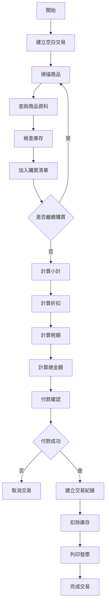

# 採購 / POS 交易系統設計規格書

## 1. 系統目標

建立一套採購／POS 銷售流程，支援：

* 商品掃描與新增
* 購買明細管理
* 自動金額計算
* 折扣與稅額計算
* 付款結帳
* 庫存管理
* 發票／明細列印

---

# 2. 資料模型設計

## 2.1 商品明細（Purchase Detail）

每筆商品使用 Dictionary（物件）儲存。

### Schema

```json
{
  "prod_id": "P12345678",
  "barcode": "4712345678901",
  "name": "商品名稱",
  "price": 120.00,
  "qty": 2,
  "amt": 240.00
}
```

### 欄位說明

| 欄位      | 型別      | 說明       |
| ------- | ------- | -------- |
| prod_id | String  | 商品唯一識別碼  |
| barcode | String  | 商品條碼     |
| name    | String  | 商品名稱     |
| price   | Decimal | 商品單價     |
| qty     | Integer | 購買數量     |
| amt     | Decimal | 金額（系統計算） |

### 計算公式

```python
amt = price * qty
```

### 設計原則

* amt 不允許人工輸入
* qty 必須大於 0
* price 必須大於等於 0
* 系統以 prod_id 作為資料關聯主鍵

---

## 2.2 購買清單（Purchase List）

使用 List 儲存多筆商品。

### Schema

```json
[
  {
    "prod_id": "P001",
    "barcode": "471000000001",
    "name": "可樂",
    "price": 40,
    "qty": 2,
    "amt": 80
  },
  {
    "prod_id": "P002",
    "barcode": "471000000002",
    "name": "洋芋片",
    "price": 50,
    "qty": 1,
    "amt": 50
  }
]
```

### 結構關係

```text
PurchaseList
└── Detail[]
    ├── prod_id
    ├── barcode
    ├── name
    ├── price
    ├── qty
    └── amt
```

---

# 3. 交易主檔（Transaction Header）

稅額、折扣與總金額屬於整筆交易資料，不應存放於商品明細。

### Schema

```json
{
  "tran_no": "T202501010001",
  "tran_date": "2025-01-01",
  "subtotal": 290,
  "discount": 20,
  "tax": 14,
  "total": 284,
  "print_count": 1,
  "details": []
}
```

### 欄位說明

| 欄位          | 說明     |
| ----------- | ------ |
| tran_no     | 交易編號   |
| tran_date   | 交易日期   |
| subtotal    | 商品小計   |
| discount    | 折扣金額   |
| tax         | 稅額     |
| total       | 應收總金額  |
| print_count | 列印份數   |
| details     | 商品明細列表 |

---

# 4. 金額計算規則

## 小計

```python
subtotal = sum(item["amt"] for item in details)
```

---

## 折扣後金額

```python
discounted_amount = subtotal - discount
```

---

## 稅額計算

```python
tax = discounted_amount * tax_rate
```

---

## 應收總額

```python
total = discounted_amount + tax
```

---

# 5. 庫存管理規範

## 錯誤做法

```text
加入購物車
    ↓
立即扣除庫存
```

### 風險

* 顧客取消交易
* 收銀中斷
* 系統異常
* 網路斷線

可能導致帳面庫存與實際庫存不一致。

---

## 正確做法

### 商品加入購物車時

執行：

```text
檢查庫存(Check Stock)
```

或

```text
預留庫存(Hold Stock)
```

不進行正式扣庫存。

---

### 付款成功後

執行：

```text
建立交易紀錄
    ↓
扣除正式庫存
    ↓
更新庫存資料表
```

---

# 6. 系統流程設計

## 主流程



---

# 7. 命名規範

## 建議

```json
{
  "qty": 2,
  "price": 120,
  "amt": 240
}
```

---

## 不建議

```json
{
  "0": "商品名稱",
  "1": 120,
  "2": 2,
  "3": 240
}
```

### 原因

* 可讀性差
* 維護困難
* 容易誤用欄位
* 不利團隊開發

---

# 8. 列印設計

系統需預留列印控制參數：

```json
{
  "print_count": 1
}
```

### 使用情境

| 場景    | 列印份數 |
| ----- | ---- |
| 客戶發票  | 1    |
| 出貨單   | 2    |
| 廚房單   | 1    |
| 倉庫撿貨單 | 1    |

---

# 9. 最終架構

```text
Transaction
│
├── tran_no
├── tran_date
├── subtotal
├── discount
├── tax
├── total
├── print_count
│
└── details[]
    │
    ├── prod_id
    ├── barcode
    ├── name
    ├── price
    ├── qty
    └── amt
```

---

# 10. 開發結論

## 採用方案

* 使用 List + Dictionary 資料結構
* 商品明細與交易主檔分離
* amt 自動計算
* tax 與 discount 放置於 Header
* 採用語意化 Key 命名
* 付款成功後才正式扣庫存
* 支援條碼管理
* 支援列印份數控制
* 可直接擴充會員、折價券、促銷活動等功能

## 開發狀態

✅ 資料結構確認完成

✅ 流程設計確認完成

✅ 庫存邏輯確認完成

✅ 可進入資料庫設計階段

✅ 可進入 API 與程式開發階段
