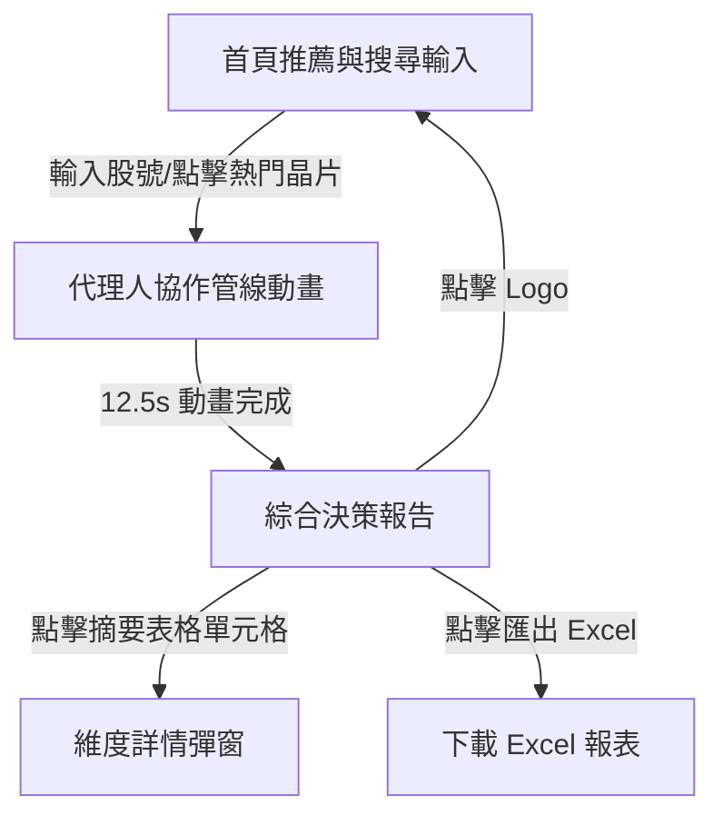

# Antigravity Stock AI - 專案規格書 (Product Requirement Document, PRD)

本文件將「台股 AI 綜合分析團隊 - 跨維度多代理人協作決策系統」的需求、功能清單與底層技術邏輯進行規格化整理，作為後續系統優化、架構擴充與測試的依據。

---

## 1. 專案概述 (Project Overview)

### 1.1 系統定位
本系統為一款**純前端（Serverless）台股綜合分析與決策系統**。系統基於 **多代理人協作管線 (Multi-Agent Pipeline)** 的概念，模擬六位不同領域的 AI 專家對台股進行獨立研究、交叉辯論與共識決策，最終產出專業的綜合投資分析報告。

### 1.2 核心設計特色
1. **暗黑磨砂玻璃視覺 (Glassmorphism)**：使用深色未來感介面，配置自定義霓虹漸層光暈與動態微動畫，提升產品質感。
2. **多代理人動態管線**：以時序動畫模擬 6 個代理人（技術面、基本面、籌碼面、總經面、公司資訊、分點面）的運作流，增強視覺互動與說服力。
3. **HTML5 雙 Canvas 繪圖引擎**：
   - **技術面**：動態繪製近 30 日日 K 線圖與 5 條均線疊加。
   - **基本面**：動態繪製近四季毛利率、營業利益率與純益率（三率）趨勢折線圖。
4. **本地無後端資料解析與智慧模擬**：
   - 內置熱門權值股（台積電、鴻海、聯發科、廣達）的 2026 真實分析數據。
   - 提供智慧模糊查詢，當輸入自訂股號時，以演算法動態生成合理且高度關聯的模擬數據。
5. **純前端一鍵 Excel 匯出**：整合 **SheetJS (XLSX)**，生成包含「專家觀點摘要」、「深度多空論證」、「操作策略與評等」的三頁籤美化 Excel 報表。

---

## 2. 使用者角色與核心流程 (User Flows)

### 2.1 系統狀態流 (System States)
系統主要包含三個核心頁面狀態：
1. **首頁推薦狀態 (Home / Recommendation Page)**：展示系統推薦之建議買進與建議賣出前 10 名個股。
2. **代理人協作動畫狀態 (Agent Pipeline Stage)**：模擬多代理人進行研究與辯論的動態歷程。
3. **決策報告狀態 (Report View)**：展示最終共識報告、多空論證與操作建議。



### 2.2 核心使用流程
1. **進入首頁**：使用者檢視目前推薦名單，可直接點擊「熱門查詢晶片」（2317、2330、2454、2382）。
2. **啟動分析**：在搜尋框輸入台灣上市、上櫃股號或股名，點擊「啟動協作分析」。
3. **觀看動畫**：系統載入代理人 stage 畫面，動態顯示計時器，各個代理人節點進入研究、質詢進度條，中央控制台即時滾動辯論日誌。
4. **閱讀報告**：
   - 閱讀專家觀點摘要、多空論點、綜合評等與操作策略。
   - 點擊摘要表格中的「技術面」、「基本面」等項目，開啟詳情 Modal。
   - 在 Modal 中檢視 HTML5 Canvas 圖表（日 K 線、三率圖）、法人表格或分點券商排名。
5. **匯出資料**：點擊「匯出 Excel 報表」，免經後端伺服器直接由瀏覽器下載 Excel。

---

## 3. 功能規格與邏輯說明 (Functional Specifications)

### 3.1 搜尋與資料解析邏輯 (Search & Query Resolution)
- **模糊匹配規則**：
  1. 清除輸入內容之特殊字元與空白。
  2. 優先比對內置資料庫（`stockDB`）中的股號與股名。
  3. 若無匹配，則查找常用個股名稱字典（`commonStockNames`）對照。
  4. 若仍無匹配，判斷格式：
     - 若為純數字：解析為自訂股號，名稱預設為「個股」。
     - 若含文字：將輸入的第一個空格字串解析為股號，第二個為股名；若無空格則預設股號為「自訂股」，股名為輸入文字。
- **自訂個股數據模擬生成器 (`generateMockReport`)**：
  - 依據輸入股號之數值雜湊值（Hash）決定走勢類型（強多、多、空）與基準價格（`basePrice = (股號 % 700) + 50`）。
  - 自動推導防守價（0.9倍）與目標價（1.25倍）。
  - 自動生成高度關聯且無異常數值的 K 線、營收、財務三率、法人買賣超與公司介紹數據。

### 3.2 代理人協作管線時序 (Multi-Agent Pipeline Timing)
模擬管線包含兩大階段，總耗時為 **12.5 秒**：

| 時間區間 | 執行動作 | 介面動態呈現 |
| :--- | :--- | :--- |
| **0.0s - 0.5s** | 系統啟動，初始化請求 | 顯示進度計時，六大代理人節點重設為「待命中...」。秘書發布啟動日誌。 |
| **0.5s - 1.5s** | 技術分析專家研究 | 「技術分析高手」節點亮起，狀態改為「獨立研究中...」，進度條增長至100%（顯示研究完成）。技術日誌發布。 |
| **1.5s - 2.5s** | 基本面專家研究 | 「基本面分析高手」節點亮起並執行相同進度條動畫。基本面日誌發布。 |
| **2.5s - 3.5s** | 籌碼面專家研究 | 「籌碼分析高手」節點亮起並執行相同進度條動畫。籌碼面日誌發布。 |
| **3.5s - 4.5s** | 總經專家研究 | 「總經分析高手」節點亮起並執行相同進度條動畫。總經日誌發布。 |
| **4.5s - 5.5s** | 公司資訊專家研究 | 「公司資訊專家」節點亮起並執行相同進度條動畫。公司資訊日誌發布。 |
| **5.5s - 11.7s** | 交叉質詢與辯論 | 代理人狀態轉為「交叉質詢中...」。每隔 1.2 至 1.5 秒由秘書或特定專家輪流於中央控制台發布對話日誌，模擬多方意見衝突與論證。 |
| **12.5s** | 達成共識，產出報告 | 停止計時。隱藏動畫 Stage，渲染並淡入最終報告區塊，並平滑滾動至報告頂端。 |

### 3.3 數據視覺化引擎規格 (Visualization Canvas Engines)

#### A. 技術 K 線繪圖引擎 (K-Line Chart)
- **畫布比例**：預設寬 800px，高 400px。
- **展示區間**：近 30 個交易日的日 K 線。
- **包含元素**：
  1. **紅黑 K 棒**：收盤價 $\ge$ 開盤價時為紅棒（`#ef4444`），收盤價 $<$ 開盤價時為綠棒（`#34d399`）。包含上下影線繪製。
  2. **成交量柱狀圖**：位於畫布下方 22% 區間，顏色對應當日 K 棒之漲跌色，高度依最大成交量等比例縮放。
  3. **五條移動平均線 (MAs)**：
     - **5MA**：桃紅色 (`#ff007f`)
     - **20MA**：湖藍色 (`#00e5ff`)
     - **60MA**：翠綠色 (`#00e676`)
     - **100MA**：黃色 (`#ffd600`)
     - **240MA**：橘色 (`#ff6d00`)
  4. **座標輔助線與標記**：
     - Y 軸展示 5 條價格等分格線與標籤。
     - X 軸展示 4 個等分日期標籤。

#### B. 基本面財務三率趨勢圖 (Finance Margin Trends)
- **畫布比例**：預設寬 800px，高 300px。
- **展示資料**：近四季毛利率、營業利益率、稅後純益率趨勢。
- **包含元素**：
  1. **折線與數據錨點**：
     - **毛利率**：紅色 (`#ff1744`)
     - **營業利益率**：藍色 (`#2979ff`)
     - **稅後純益率**：綠色 (`#00e676`)
  2. **圖表標籤**：於每個數據點上方標示精確百分比數值（例如 `54.50%`）。
  3. **網格系統**：Y 軸等分刻度百分比，X 軸標示對應季度（例如 `26Q1`）。

### 3.4 分點交易數據統計規格 (Broker Branch Analytics)
- **時序選擇器**：支援 5、10、20、60、240 天切換按鈕。
- **數據展示**：
  - 前 15 大買進券商分點：序號、分點名稱、買進張數、佔比（累計佔前 15 大比重）。
  - 前 15 大賣出券商分點：序號、分點名稱、賣出張數、佔比。
- **AI 操作建議演算邏輯**：
  - 依據券商進出買賣淨額因數（`factor`）決定操作評等文字：
    - `factor > 0` (偏買)：提示主力大單認養、平均成本與偏多拉回布局策略。
    - `factor == 0` (中立)：提示區間整理、主力良性換手與觀望待變。
    - `factor < 0` (偏賣)：提示主力出貨、籌碼分散、建議減碼避開。

### 3.5 股市高手群組選股建議規格 (Stock Masters Group)
新增「股市高手群組」頁籤模組，整合三位傳奇大師的策略進行個股評估：
- **威廉‧歐尼爾 (William O'Neil) - CAN SLIM 策略**：
  - 評估維度：**C**（季盈餘動能/營收YoY）、**A**（年盈餘/ROE）、**N**（新產品/題材/股價新高）、**S**（股本與突破量能）、**L**（行業領導股/相對強度）、**I**（投信與法人鎖碼）、**M**（大盤多空配合度）。
  - 指標呈現：歐尼爾飆股指數（1-10 分）、突破買進價位、防守止損價位。
- **華倫‧巴菲特 (Warren Buffett) - 經濟護城河價值投資策略**：
  - 評估維度：**Moat**（競爭優勢）、**ROE**（資本回報率）、**Debt**（財務槓桿風險）、**Mgmt**（資本配置）、**Safety**（安全邊際/估值）。
  - 指標呈現：巴菲特價值指數（1-10 分）、合理買進價位、長線防守警戒線。
- **彼得‧林區 (Peter Lynch) - 投資價值評估策略**：
  - 評估維度（結構化四步驟）：**第Ⅰ步**（生活投資學與護城河檢驗）、**第Ⅱ步**（台股六大分類歸屬）、**第Ⅲ步**（在地化財務體檢）、**第Ⅳ步**（買進/賣出訊號與風險警示）。
  - 指標呈現：彼得林區成長指數（1-10 分）、**林區流專屬投資評等（強烈推薦買進/列入觀察名單/暫時觀望/避開）**、分批配置區間、轉弱警告水位。

### 3.6 Excel 報表匯出規格 (Excel Export Engine)
整合 `xlsx.full.min.js`，將報告內容格式化為試算表並下載：
- **檔案命名規則**：`[股號]_[股名]_綜合分析報告_[YYYYMMDD].xlsx`
- **工作表設計 (Multi-Sheet Layout)**：
  1. **工作表 1：專家觀點摘要**
     - 表頭：系統名稱、個股代號/名稱、分析日期。
     - 欄位：領域、核心結論、關鍵理由。
     - 欄寬自動調整。
  2. **工作表 2：深度多空論證**
     - 欄位：類型（多方亮點/空方風險）、核心論證細節。
     - 自動去除 HTML 標籤（如 `<span>` 等）。
  3. **工作表 3：操作策略與評等**
     - 欄位：決策項目、核心決策內容。
     - 包含項目：團隊綜合評等、策略建議、防守/停損價位。
  4. **工作表 4：股市高手選股建議**
     - 包含項目：威廉‧歐尼爾、巴菲特、彼得‧林區、葛拉漢（七大指標體檢、Net-Net 測試、投資建議）的完整評估細節。

---

## 4. 介面規格與設計系統 (UI/UX Design System)

### 4.1 設計風格 (Visual Identity)
- **主題**：高質感霓虹暗黑風格 (Glassmorphism & Cyberpunk Neon)。
- **核心 CSS 變數**：
  ```css
  :root {
      --bg-main: #060913;          /* 深藍黑背景 */
      --card-bg: rgba(13, 20, 38, 0.6); /* 半透明磨砂玻璃卡片 */
      --card-border: rgba(255, 255, 255, 0.08);
      --neon-blue: #00f0ff;        /* 霓虹藍 */
      --neon-purple: #bd00ff;      /* 霓虹紫 */
      --text-primary: #f3f4f6;     /* 亮灰白 */
      --text-secondary: #9ca3af;   /* 中灰 */
      --val-up: #ef4444;           /* 台股上漲（紅） */
      --val-down: #34d399;         /* 台股下跌（綠） */
  }
  ```

### 4.2 響應式佈局 (Responsive Breakpoints)
- **Desktop (1024px 以上)**：搜尋面板置中，左右光暈渲染；報表區塊與多空卡片採雙欄並排佈局；Modal 採 800px 寬度。
- **Tablet / Mobile (1024px 以下)**：自動切換為單欄垂直佈局；Modal 寬度自適應 95% 並啟用滾動條；表格容器支援水平滑動以防止破版。

### 4.3 UI 關鍵微動畫與反饋
- **磨砂玻璃效果**：`backdrop-filter: blur(16px) saturate(120%)`。
- **按鈕懸停動畫**：霓虹漸層邊框發光、寬度微幅縮放與影深位移。
- **代理人節點動態**：當前分析的代理人發散呼吸光暈，進度條流暢增加。
- **資料加載反饋**：點擊跳轉時採用平滑滾動（`scrollIntoView({ behavior: 'smooth' })`）。

---

## 5. 技術規格與相容性 (Tech Stack & Compatibility)

- **核心架構**：不依賴後端與編譯框架，採用純前端原生三劍客（HTML5 / Vanilla CSS3 / Vanilla JS）。
- **外部依賴庫**：
  - **SheetJS (XLSX)**：用於生成與下載 Excel（CDN 引入）。
  - **FontAwesome 6.4.0**：系統圖標（CDN 引入）。
  - **Google Fonts**：字體集 Outfit（英文數字）與 Noto Sans TC（繁體中文）（網頁內嵌）。
- **相容性要求**：
  - 支援現代主流瀏覽器（Chrome, Edge, Safari, Firefox）。
  - 圖表 Canvas 繪製機制須支援 Retina 螢幕解析度（防模糊處理）。
  - 本地安全限制下，匯出功能在標準 `http` 協議之本地或伺服器環境相容性最佳。

---

*免責聲明規格：所有生成的報告與分析內容下方均須常駐免責聲明文字，註明報告內容係為 AI 模擬與資料整合，不構成實際投資建議。*
