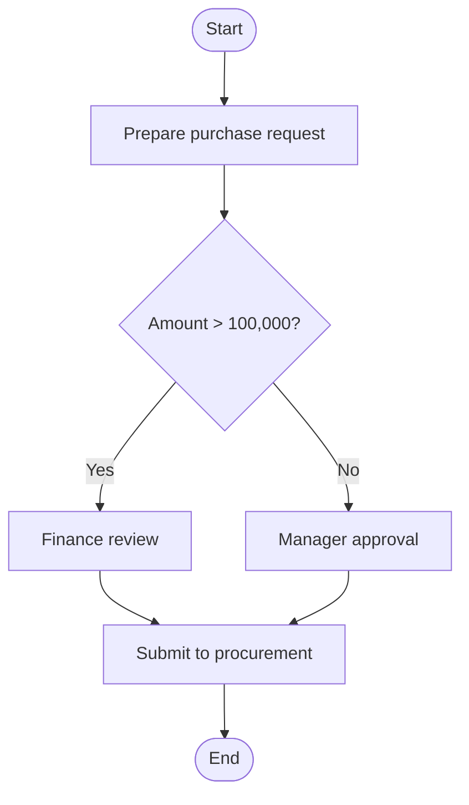

# M04_SOP_Generation_Engine

AI Knowledge Transfer System

Module Specification

Module: M04
Module Name: SOP Generator
Engine: SOP Generation Engine
Version: v1.0.0
Owner: System Architect
Last Update: 2026-06-25

## 1. Purpose

The M04 SOP Generation Engine converts raw enterprise knowledge into structured SOP artifacts.

Input sources:

- Documents
- Experience records
- Meeting transcripts
- FAQ
- Case Study
- Email
- Manual input

Outputs:

- Standard SOP
- Process flow
- FAQ
- Training content
- Quiz
- Version records
- AI QA and Agent-ready knowledge

## 2. Engine Overview

```text
Input Sources
↓
Content Normalization
↓
Process Detection
↓
Step Extraction
↓
Role Extraction
↓
Decision Point Detection
↓
Exception Flow Detection
↓
SOP Draft Generation
↓
Flowchart Generation
↓
FAQ Generation
↓
Training Material Generation
↓
Human Review
↓
Publish
↓
RAG Index
```

## 3. Input Sources

Supported input sources:

```text
M01 documents
M03 experience_records
knowledge_items
meeting_transcripts
faq
case_studies
manual_input
email_threads
screen_recording_transcript
video_transcript
```

## 4. Input Requirements

Required fields:

```text
title
department_id
sop_type
input_sources
target_audience
permission_scope
language
```

Optional fields:

```text
existing_sop_id
business_rules
approval_rules
role_mapping
risk_notes
reference_documents
```

## 5. SOP Types

```text
operation_sop
maintenance_sop
procurement_sop
hr_sop
finance_sop
audit_sop
training_sop
customer_service_sop
it_sop
quality_control_sop
```

## 6. Content Normalization

All source content should be normalized before SOP analysis.

### 6.1 Normalized Content Schema

```json
{
  "source_id": "uuid",
  "source_type": "document | experience | meeting | faq | case | email | manual",
  "title": "source title",
  "content": "clean text",
  "metadata": {
    "department_id": "uuid",
    "author": "string",
    "created_at": "timestamp",
    "permission_scope": "department",
    "language": "en"
  }
}
```

## 7. Process Detection

AI should detect whether the source content is a valid SOP candidate.

### 7.1 Detection Criteria

```text
has_steps
has_roles
has_decisions
has_inputs
has_outputs
has_exception_cases
has_repeated_operation
```

### 7.2 Output

```json
{
  "is_sop_candidate": true,
  "confidence_score": 0.91,
  "detected_process_name": "Purchase Request Process",
  "reason": "The content includes sequential steps, responsible roles, decision points, and approval rules."
}
```

## 8. Step Extraction

AI extracts process steps from source content.

### 8.1 Step Fields

```text
step_id
step_order
step_title
description
responsible_role
input_data
output_data
system_used
estimated_time
required_documents
risk_notes
```

### 8.2 Step Example

```json
{
  "step_order": 1,
  "step_title": "Prepare purchase request",
  "description": "Employee enters purchase information in the ERP system.",
  "responsible_role": "Employee",
  "input_data": ["request purpose", "supplier", "item code"],
  "output_data": ["purchase request"],
  "system_used": ["ERP"],
  "estimated_time": "10 minutes",
  "required_documents": ["quotation"],
  "risk_notes": ["Incorrect item code may delay approval."]
}
```

## 9. Role Extraction

AI extracts roles used in the SOP.

### 9.1 Common Roles

```text
Employee
Department Manager
Procurement
Finance
HR
IT
Quality Control
Warehouse
Supplier
Customer
Administrator
```

### 9.2 Role Output

```json
{
  "role": "Department Manager",
  "responsibilities": [
    "Review purchase request",
    "Validate budget",
    "Approve or reject request"
  ]
}
```

## 10. Decision Point Detection

AI detects decision points in the process.

### 10.1 Example

```text
Is the purchase amount greater than 100,000?
```

### 10.2 Decision Fields

```text
decision_id
question
condition
yes_action
no_action
responsible_role
risk_level
```

### 10.3 Decision Output Example

```json
{
  "question": "Is the purchase amount greater than 100,000?",
  "condition": "amount > 100000",
  "yes_action": "Submit to finance review",
  "no_action": "Submit to department manager approval",
  "responsible_role": "Department Manager",
  "risk_level": "medium"
}
```

## 11. Exception Flow Detection

AI detects exception flows.

### 11.1 Exception Examples

```text
Manager rejected
Supplier delayed delivery
Required data missing
System unavailable
Approval timeout
Customer change request
Equipment abnormality
```

### 11.2 Exception Fields

```text
exception_id
trigger_condition
description
handling_steps
responsible_role
escalation_rule
```

## 12. SOP Draft Generation

Standard SOP draft sections:

```text
1. Purpose
2. Scope
3. Definitions
4. Roles and Responsibilities
5. Procedure
6. Decision Rules
7. Exception Handling
8. Required Forms / Documents
9. System Usage
10. Risk and Control Points
11. FAQ
12. References
13. Revision History
```

## 13. SOP Output Schema

```json
{
  "title": "Purchase Request Process SOP",
  "department_id": "uuid",
  "sop_type": "procurement_sop",
  "purpose": "Standardize the purchase request process.",
  "scope": "Applies to all department purchase requests.",
  "roles": [],
  "steps": [],
  "decisions": [],
  "exceptions": [],
  "faq": [],
  "references": [],
  "revision_history": []
}
```

## 14. Flowchart Generation

Flowcharts should use Mermaid.

### 14.1 Flowchart Rule

```text
Start node
Step node
Decision node
Exception node
End node
```

### 14.2 Mermaid Example



## 15. FAQ Generation

AI generates FAQ from SOP content.

### 15.1 FAQ Output

```json
[
  {
    "question": "What is the first step in the purchase request process?",
    "answer": "Prepare the purchase request with required information.",
    "source_step": "step_001"
  },
  {
    "question": "What happens if the purchase amount is greater than 100,000?",
    "answer": "The request must be submitted for finance review.",
    "source_decision": "decision_001"
  }
]
```

## 16. Training Material Generation

AI generates training content from SOPs.

### 16.1 Training Output

```text
summary
learning_objectives
lesson_outline
quiz
flash_cards
common_mistakes
```

### 16.2 Quiz Example

```json
{
  "question": "What is the first step in the purchase request process?",
  "options": [
    "Submit to procurement",
    "Prepare purchase request",
    "Receive goods",
    "Close case"
  ],
  "answer": "Prepare purchase request",
  "explanation": "The purchase request must be prepared before approval and procurement submission."
}
```

## 17. Quality Validation

AI-generated SOPs should be validated for:

```text
has_purpose
has_scope
has_roles
has_steps
has_decisions
has_exceptions
has_faq
has_references
has_revision_history
```

### 17.1 Quality Score

```text
0-100
```

Score interpretation:

```text
90-100: Ready for review
70-89: Needs improvement
0-69: Not acceptable
```

## 18. Citation Mapping

Each SOP step should map to source evidence where possible.

### 18.1 Citation Fields

```text
source_type
source_id
source_title
page_number
chunk_id
quote_text
confidence_score
```

## 19. Human Review

AI-generated SOPs require human review before publishing.

Flow:

```text
AI Draft
↓
Reviewer Edit
↓
Quality Check
↓
Approve
↓
Publish
```

## 20. Version Control

Supported versions:

```text
v1.0
v1.1
v1.2
v2.0
```

Version metadata:

```text
version_no
created_by
change_note
diff_summary
created_at
```

## 21. Version Compare

Comparison should support:

```text
added_steps
removed_steps
changed_steps
changed_roles
changed_decisions
changed_exceptions
```

## 22. Auto Update Detection

The system should detect whether related source changes require SOP updates.

### 22.1 Trigger

```text
source_document_updated
experience_updated
faq_updated
case_updated
policy_updated
```

### 22.2 Output

```json
{
  "sop_id": "uuid",
  "update_required": true,
  "reason": "The related procurement policy was updated to v2.0 and affects step 3.",
  "affected_steps": ["step_003"]
}
```

## 23. Background Jobs

Queue:

```text
Redis + Celery
```

Jobs:

```text
sop_candidate_detection_job
sop_step_extraction_job
sop_role_extraction_job
sop_decision_extraction_job
sop_exception_extraction_job
sop_draft_generation_job
sop_flowchart_generation_job
sop_faq_generation_job
sop_training_generation_job
sop_quality_validation_job
sop_embedding_job
sop_publish_job
```

## 24. Error Handling

Error codes:

```text
SOP_INPUT_EMPTY
SOP_NOT_CANDIDATE
SOP_STEP_EXTRACTION_FAILED
SOP_DECISION_EXTRACTION_FAILED
SOP_FLOWCHART_FAILED
SOP_FAQ_FAILED
SOP_QUIZ_FAILED
SOP_QUALITY_TOO_LOW
SOP_REVIEW_REQUIRED
SOP_PUBLISH_FAILED
```

## 25. Security

Security requirements:

```text
JWT
RBAC
Department Isolation
Permission Scope
Audit Log
Sensitive Data Masking
Version Lock
Approval Required
```

## 26. Audit Log

Events:

```text
generate_sop
edit_sop
approve_sop
publish_sop
rollback_sop
compare_sop_version
delete_sop
export_sop
```

## 27. Integration

### 27.1 M01 Document Center

Uses document knowledge as SOP source evidence.

### 27.2 M03 Experience Transfer

Uses experience records, cases, and FAQ as SOP source evidence.

### 27.3 M02 AI QA Assistant

Makes published SOPs available to AI QA.

### 27.4 M05 Training Center

Provides SOP-based training material.

### 27.5 M06 AI Agent

Provides SOP steps for Agent task guidance.

## 28. Success KPI

```text
SOP Generation Success Rate > 95%
SOP Quality Score > 85
Flowchart Generation Success Rate > 90%
FAQ Generation Accuracy > 85%
Training Material Completion > 90%
Review Approval Rate > 80%
Citation Coverage > 90%
```

## 29. Future Enhancements

```text
Screen Recording To SOP
Video To SOP
Browser Action To SOP
AI Process Mining
SOP Simulation
Agent Execution Checklist
Knowledge Graph SOP
Auto SOP Refactoring
```

## 30. Final Goal

The M04 SOP Generation Engine turns raw knowledge into standardized operating knowledge.

```text
Raw Knowledge
↓
Structured Workflow
↓
Standard SOP
↓
Training Material
↓
AI QA
↓
AI Agent
↓
Enterprise Operating System
```

The final goal is to make business operations traceable, teachable, updatable, and executable by people and AI Agents.
