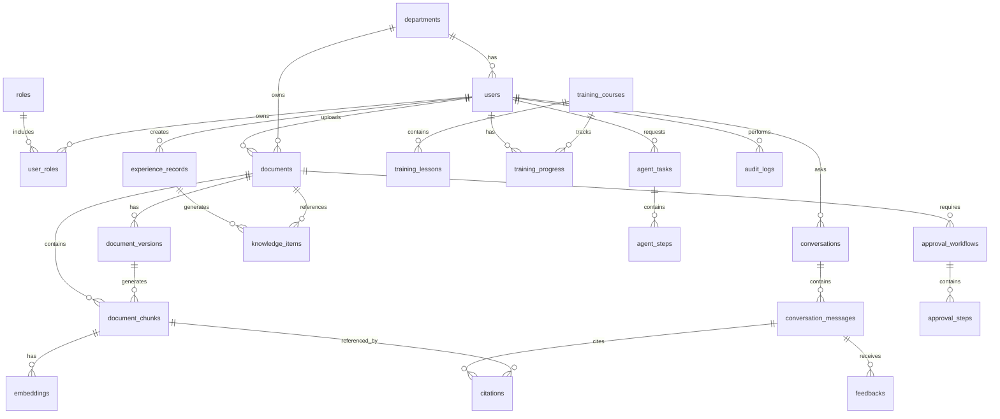

# AI Knowledge Transfer System (KTS)

## ERD v1

Version: v1.0.0
Document Type: ERD Specification
Author: Project Manager / System Architect
Last Updated: 2026-06-25

## 1. ERD Goal

Define the v1 data model for the AI Knowledge Transfer System.

v1 covers:

- Users and access control
- Departments and roles
- Document knowledge management
- Document versions and chunks
- Embeddings for RAG
- AI QA conversations
- Citations and feedback
- Audit logs
- Training records
- AI Agent tasks
- Knowledge governance

## 2. Core Entity Groups

```text
1. Identity & Access
2. Organization
3. Knowledge Document
4. RAG & AI QA
5. Experience Transfer
6. Training
7. Agent
8. Governance & Audit
```

## 3. Mermaid ERD



## 4. Table Definitions

### 4.1 departments

Purpose: stores organization departments.

| Field | Type | Description |
|---|---|---|
| id | UUID | Primary Key |
| name | VARCHAR | Department name |
| code | VARCHAR | Department code |
| parent_id | UUID | Parent department |
| status | VARCHAR | active / inactive |
| created_at | TIMESTAMP | Created time |
| updated_at | TIMESTAMP | Updated time |

### 4.2 users

Purpose: stores system users.

| Field | Type | Description |
|---|---|---|
| id | UUID | Primary Key |
| department_id | UUID | FK departments.id |
| name | VARCHAR | User name |
| email | VARCHAR | Email |
| password_hash | VARCHAR | Password hash |
| job_title | VARCHAR | Job title |
| status | VARCHAR | active / inactive / suspended |
| last_login_at | TIMESTAMP | Last login time |
| created_at | TIMESTAMP | Created time |
| updated_at | TIMESTAMP | Updated time |

### 4.3 roles

Purpose: stores role definitions.

Default roles:

- Employee
- Department Manager
- Administrator
- Auditor

| Field | Type | Description |
|---|---|---|
| id | UUID | Primary Key |
| name | VARCHAR | Role name |
| description | TEXT | Role description |
| created_at | TIMESTAMP | Created time |
| updated_at | TIMESTAMP | Updated time |

### 4.4 user_roles

Purpose: maps users to roles.

| Field | Type | Description |
|---|---|---|
| id | UUID | Primary Key |
| user_id | UUID | FK users.id |
| role_id | UUID | FK roles.id |
| created_at | TIMESTAMP | Created time |

### 4.5 documents

Purpose: stores document master records.

| Field | Type | Description |
|---|---|---|
| id | UUID | Primary Key |
| department_id | UUID | FK departments.id |
| uploaded_by | UUID | FK users.id |
| title | VARCHAR | Document title |
| description | TEXT | Document description |
| file_type | VARCHAR | pdf / docx / xlsx / pptx / image / audio / video / markdown |
| storage_path | VARCHAR | MinIO / Object Storage path |
| permission_scope | VARCHAR | public / department / private / confidential / admin_only |
| status | VARCHAR | draft / processing / published / archived / rejected |
| current_version | VARCHAR | Current version |
| created_at | TIMESTAMP | Created time |
| updated_at | TIMESTAMP | Updated time |

### 4.6 document_versions

Purpose: stores document version history.

| Field | Type | Description |
|---|---|---|
| id | UUID | Primary Key |
| document_id | UUID | FK documents.id |
| version_no | VARCHAR | v1.0.0 |
| file_hash | VARCHAR | File hash |
| storage_path | VARCHAR | Version file storage path |
| change_note | TEXT | Version change note |
| created_by | UUID | FK users.id |
| created_at | TIMESTAMP | Created time |

### 4.7 document_chunks

Purpose: stores RAG-ready document chunks.

| Field | Type | Description |
|---|---|---|
| id | UUID | Primary Key |
| document_id | UUID | FK documents.id |
| document_version_id | UUID | FK document_versions.id |
| chunk_index | INTEGER | Chunk order |
| title | VARCHAR | Chunk title |
| section | VARCHAR | Document section |
| page_number | INTEGER | Page number |
| content | TEXT | Chunk content |
| token_count | INTEGER | Token count |
| metadata | JSONB | Extra metadata |
| created_at | TIMESTAMP | Created time |

### 4.8 embeddings

Purpose: stores vector embeddings.

| Field | Type | Description |
|---|---|---|
| id | UUID | Primary Key |
| chunk_id | UUID | FK document_chunks.id |
| embedding_model | VARCHAR | Embedding model name |
| vector | VECTOR | pgvector value |
| dimension | INTEGER | Vector dimension |
| created_at | TIMESTAMP | Created time |

### 4.9 conversations

Purpose: stores AI QA conversation sessions.

| Field | Type | Description |
|---|---|---|
| id | UUID | Primary Key |
| user_id | UUID | FK users.id |
| title | VARCHAR | Conversation title |
| channel | VARCHAR | web / mobile / line |
| created_at | TIMESTAMP | Created time |
| updated_at | TIMESTAMP | Updated time |

### 4.10 conversation_messages

Purpose: stores AI QA messages.

| Field | Type | Description |
|---|---|---|
| id | UUID | Primary Key |
| conversation_id | UUID | FK conversations.id |
| sender_type | VARCHAR | user / assistant / system |
| message | TEXT | Message content |
| model_name | VARCHAR | Model name |
| token_usage | INTEGER | Token usage |
| confidence_score | DECIMAL | Confidence score |
| created_at | TIMESTAMP | Created time |

### 4.11 citations

Purpose: stores citations used by AI answers.

| Field | Type | Description |
|---|---|---|
| id | UUID | Primary Key |
| message_id | UUID | FK conversation_messages.id |
| chunk_id | UUID | FK document_chunks.id |
| document_id | UUID | FK documents.id |
| page_number | INTEGER | Cited page number |
| quote_text | TEXT | Quoted text |
| relevance_score | DECIMAL | Relevance score |
| created_at | TIMESTAMP | Created time |

### 4.12 feedbacks

Purpose: stores user feedback for AI answers.

| Field | Type | Description |
|---|---|---|
| id | UUID | Primary Key |
| message_id | UUID | FK conversation_messages.id |
| user_id | UUID | FK users.id |
| rating | INTEGER | 1-5 |
| feedback_type | VARCHAR | helpful / wrong / incomplete / unsafe |
| comment | TEXT | User comment |
| created_at | TIMESTAMP | Created time |

### 4.13 experience_records

Purpose: stores experience transfer records from audio, video, text, interviews, or meetings.

| Field | Type | Description |
|---|---|---|
| id | UUID | Primary Key |
| created_by | UUID | FK users.id |
| department_id | UUID | FK departments.id |
| title | VARCHAR | Experience title |
| source_type | VARCHAR | audio / video / text / interview / meeting |
| raw_storage_path | VARCHAR | Original file storage path |
| transcript | TEXT | Transcript |
| summary | TEXT | AI summary |
| status | VARCHAR | draft / reviewed / published / archived |
| created_at | TIMESTAMP | Created time |
| updated_at | TIMESTAMP | Updated time |

### 4.14 knowledge_items

Purpose: stores structured knowledge items such as FAQ, SOP, cases, tips, and policies.

| Field | Type | Description |
|---|---|---|
| id | UUID | Primary Key |
| source_document_id | UUID | FK documents.id |
| source_experience_id | UUID | FK experience_records.id |
| department_id | UUID | FK departments.id |
| title | VARCHAR | Knowledge title |
| knowledge_type | VARCHAR | faq / sop / case / tip / policy |
| question | TEXT | FAQ question |
| answer | TEXT | FAQ answer |
| content | TEXT | Knowledge content |
| status | VARCHAR | draft / reviewed / published / archived |
| created_by | UUID | FK users.id |
| created_at | TIMESTAMP | Created time |
| updated_at | TIMESTAMP | Updated time |

### 4.15 training_courses

Purpose: stores training courses.

| Field | Type | Description |
|---|---|---|
| id | UUID | Primary Key |
| department_id | UUID | FK departments.id |
| title | VARCHAR | Course title |
| description | TEXT | Course description |
| role_target | VARCHAR | Target role |
| status | VARCHAR | draft / published / archived |
| created_by | UUID | FK users.id |
| created_at | TIMESTAMP | Created time |
| updated_at | TIMESTAMP | Updated time |

### 4.16 training_lessons

Purpose: stores training lessons.

| Field | Type | Description |
|---|---|---|
| id | UUID | Primary Key |
| course_id | UUID | FK training_courses.id |
| title | VARCHAR | Lesson title |
| content | TEXT | Lesson content |
| lesson_order | INTEGER | Lesson order |
| reference_document_id | UUID | FK documents.id |
| created_at | TIMESTAMP | Created time |

### 4.17 training_progress

Purpose: stores user training progress.

| Field | Type | Description |
|---|---|---|
| id | UUID | Primary Key |
| user_id | UUID | FK users.id |
| course_id | UUID | FK training_courses.id |
| progress_percent | DECIMAL | Progress percentage |
| status | VARCHAR | not_started / in_progress / completed |
| score | DECIMAL | Score |
| completed_at | TIMESTAMP | Completion time |
| updated_at | TIMESTAMP | Updated time |

### 4.18 agent_tasks

Purpose: stores AI Agent tasks.

| Field | Type | Description |
|---|---|---|
| id | UUID | Primary Key |
| requested_by | UUID | FK users.id |
| agent_type | VARCHAR | procurement / hr / it / training / offboarding / audit |
| task_title | VARCHAR | Task title |
| task_input | TEXT | User input |
| task_output | TEXT | Agent output |
| status | VARCHAR | pending / running / completed / failed / cancelled |
| created_at | TIMESTAMP | Created time |
| completed_at | TIMESTAMP | Completion time |

### 4.19 agent_steps

Purpose: stores AI Agent execution steps.

| Field | Type | Description |
|---|---|---|
| id | UUID | Primary Key |
| task_id | UUID | FK agent_tasks.id |
| step_order | INTEGER | Step order |
| action_type | VARCHAR | search / retrieve / analyze / generate / validate |
| input_payload | JSONB | Input payload |
| output_payload | JSONB | Output payload |
| status | VARCHAR | pending / running / completed / failed |
| created_at | TIMESTAMP | Created time |

### 4.20 approval_workflows

Purpose: stores knowledge approval workflows.

| Field | Type | Description |
|---|---|---|
| id | UUID | Primary Key |
| target_type | VARCHAR | document / knowledge_item / sop |
| target_id | UUID | Target record ID |
| requested_by | UUID | FK users.id |
| status | VARCHAR | pending / approved / rejected / cancelled |
| created_at | TIMESTAMP | Created time |
| updated_at | TIMESTAMP | Updated time |

### 4.21 approval_steps

Purpose: stores approval workflow steps.

| Field | Type | Description |
|---|---|---|
| id | UUID | Primary Key |
| workflow_id | UUID | FK approval_workflows.id |
| approver_id | UUID | FK users.id |
| step_order | INTEGER | Approval step order |
| status | VARCHAR | pending / approved / rejected |
| comment | TEXT | Approval comment |
| reviewed_at | TIMESTAMP | Review time |

### 4.22 audit_logs

Purpose: stores system audit logs.

| Field | Type | Description |
|---|---|---|
| id | UUID | Primary Key |
| user_id | UUID | FK users.id |
| action | VARCHAR | Action name |
| target_type | VARCHAR | Target type |
| target_id | UUID | Target record ID |
| ip_address | VARCHAR | IP address |
| user_agent | TEXT | User agent |
| metadata | JSONB | Extra metadata |
| created_at | TIMESTAMP | Created time |

## 5. Suggested Indexes

```sql
CREATE INDEX idx_users_department_id ON users(department_id);
CREATE INDEX idx_documents_department_id ON documents(department_id);
CREATE INDEX idx_documents_status ON documents(status);
CREATE INDEX idx_document_chunks_document_id ON document_chunks(document_id);
CREATE INDEX idx_conversations_user_id ON conversations(user_id);
CREATE INDEX idx_messages_conversation_id ON conversation_messages(conversation_id);
CREATE INDEX idx_citations_message_id ON citations(message_id);
CREATE INDEX idx_feedbacks_message_id ON feedbacks(message_id);
CREATE INDEX idx_audit_logs_user_id ON audit_logs(user_id);
CREATE INDEX idx_audit_logs_created_at ON audit_logs(created_at);
```

## 6. pgvector Index

```sql
CREATE INDEX idx_embeddings_vector
ON embeddings
USING ivfflat (vector vector_cosine_ops)
WITH (lists = 100);
```

## 7. v1 MVP Required Tables

```text
departments
users
roles
user_roles
documents
document_versions
document_chunks
embeddings
conversations
conversation_messages
citations
feedbacks
audit_logs
```

## 8. Future Tables

```text
experience_records
knowledge_items
training_courses
training_lessons
training_progress
agent_tasks
agent_steps
approval_workflows
approval_steps
```

## 9. Design Principles

### 9.1 UUID First

Use UUID primary keys for portability and distributed system readiness.

### 9.2 Audit Ready

Important user and system actions should be auditable.

### 9.3 Permission Ready

Documents and knowledge should support permission scope from the beginning.

### 9.4 RAG Ready

Document chunks, embeddings, citations, and feedback should support reliable RAG workflows.

### 9.5 Version Ready

Documents and SOP content should support version history.

## 10. Next Step

Recommended next document:

```text
spec/API/API_v1.md
```

Recommended API areas:

- Auth API
- Document API
- Search API
- AI QA API
- Feedback API
- Admin API
