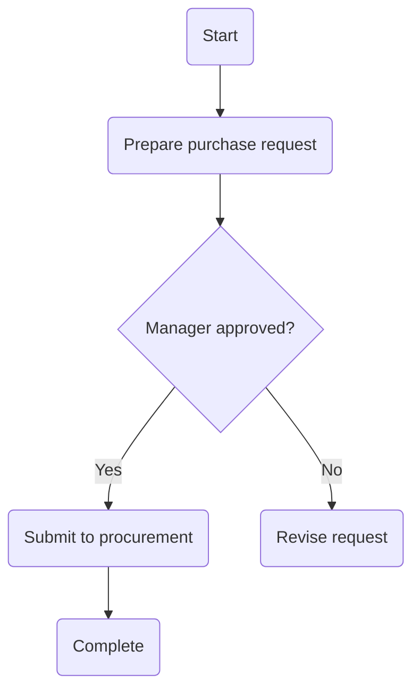

# PRD_M04_SOP_Generator

AI Knowledge Transfer System

Product Requirement Document

Module: M04
Module Name: SOP Generator
Version: v1.0.0
Owner: Product Manager
Last Update: 2026-06-25

## 1. Module Vision

M04 AI SOP Generator converts enterprise knowledge into structured SOPs.

Input sources:

- Document
- Experience
- Meeting
- Case
- FAQ

AI-generated outputs:

- SOP
- Flowchart
- Training Material
- Quiz
- AI Mentor content

The goal is to reduce SOP creation time, improve SOP quality, prevent knowledge loss, and standardize enterprise processes.

## 2. Business Problems

The module addresses:

- SOPs are scattered or outdated.
- SOP versions are difficult to manage.
- Teams rely on verbal process explanations.
- SOP updates are slow.
- New employees cannot easily learn SOPs.
- Expert experience is not converted into process knowledge.

## 3. Module Objectives

- Generate SOP drafts with AI.
- Generate process flowcharts with AI.
- Generate FAQ from SOP content.
- Generate training material from SOP content.
- Support SOP updates and version management.

## 4. Input Sources

- M01 Document Center
- M03 Experience Transfer
- Meeting Transcript
- Email
- Case Study
- FAQ
- Manual Input

## 5. SOP Generation Workflow

```text
Document
+
Experience
+
Meeting
↓
AI Analysis
↓
Step Detection
↓
Decision Point
↓
Exception Flow
↓
SOP Draft
↓
Flowchart
↓
FAQ
↓
Training Material
↓
Human Review
↓
Publish
```

## 6. User Stories

### Story 1: Expert Converts Experience into SOP

As an expert, I want AI to generate SOP drafts from my experience records.

### Story 2: Manager Converts Maintenance Case into SOP

As a manager, I want AI to turn troubleshooting cases into standardized SOPs.

### Story 3: Meeting Transcript Becomes Process Knowledge

As a project owner, I want AI to convert meeting records into process steps.

### Story 4: New Employee Learns SOP with AI Mentor

As a new employee, I want AI Mentor guidance based on SOP content.

## 7. SOP Types

Supported SOP types:

- Operation SOP
- Maintenance SOP
- HR SOP
- Procurement SOP
- Finance SOP
- Audit SOP
- Training SOP

## 8. Functional Requirements

### FR001 Generate SOP

Input:

```text
documents
experience
meeting
faq
case
```

Output:

```text
sop
flowchart
summary
faq
quiz
```

### FR002 Generate Flowchart

AI should generate flowchart structures:

```text
Start
↓
Step
↓
Decision
↓
Action
↓
End
```

### FR003 Generate FAQ

Example:

```text
Q: What should be prepared before submitting a purchase request?
A: Prepare the request form, approval documents, and supplier information.
```

### FR004 Generate Training Material

AI should generate:

- Summary
- Slides
- Quiz
- Flash Cards

## 9. SOP Structure

Standard SOP sections:

- Purpose
- Scope
- Role & Responsibility
- Procedure
- Exception Handling
- FAQ
- References
- Revision History

## 10. Procedure Format

Example:

```text
Step 1
Prepare the purchase request.
Responsible: Employee

Step 2
Review and approve the request.
Responsible: Manager

Step 3
Submit to procurement.
Responsible: Procurement
```

## 11. Decision Flow

Example:

```text
Is purchase amount > 100,000?
↓
Yes
↓
Department Manager Review
↓
Finance Review
↓
Approved

No
↓
Department Manager Review
↓
Approved
```

## 12. Flowchart Generation

AI output format:

```text
Mermaid
```

Example:



## 13. Exception Handling

Example:

```text
Supplier cannot deliver on time
↓
Contact backup supplier
↓
Update expected delivery date
↓
Notify manager
```

## 14. AI Summary

Example:

```text
SOP Summary:
This SOP explains the purchase request process.

Scope:
1. Prepare purchase request.
2. Manager approval.
3. Procurement submission.
4. Attachment review.
```

## 15. FAQ Generation

AI-generated FAQ examples:

```text
Q: What should be prepared before purchase request submission?
Q: What should I do if manager approval is rejected?
Q: What should I do if the supplier cannot deliver?
```

## 16. Training Material

AI-generated materials:

- Summary
- Slides
- Quiz
- Flash Card

Example:

```text
Q: What is the first step in the purchase process?
A: Prepare the purchase request.
```

## 17. Quiz Generation

Example:

```text
Q1: What is the first step in purchase request submission?
A: Prepare the purchase request.

Q2: What happens after manager approval?
A: Submit the request to procurement.
```

## 18. Version Control

Supported version format:

```text
v1.0
v1.1
v1.2
v2.0
```

Version records should include:

- Change Note
- Author
- Date
- Compare Version
- Rollback

## 19. Approval Workflow

```text
AI Draft
↓
Department Review
↓
Edit
↓
Approve
↓
Publish
```

## 20. Permission

Supported permission scopes:

```text
public
department
private
confidential
admin_only
```

## 21. Search Integration

M02 AI QA should be able to retrieve:

- SOP
- Flowchart
- FAQ
- Training Material
- Quiz

## 22. AI Mentor Integration

Example:

```text
User asks: What is the manager approval process?
↓
AI retrieves SOP.
↓
AI provides step-by-step guidance.
↓
AI shows related FAQ.
```

## 23. Dashboard

Dashboard metrics:

- Total SOP
- Pending Review
- Published SOP
- Top Viewed SOP
- Training Completion
- Quiz Accuracy

## 24. KPI

| KPI | Target |
|---|---:|
| SOP Generate Success | > 95% |
| Review Completion | > 90% |
| Training Satisfaction | > 4.5 / 5 |
| AI Citation Rate | > 95% |

## 25. Future Features

- Video To SOP
- Screen Recording To SOP
- Browser Action To SOP
- AI Process Mining
- AI Workflow Designer
- Knowledge Graph SOP

## 26. Design Principles

- AI First
- Human Review Required
- Version Control
- Traceable Citation
- Training Ready
- Agent Ready

## 27. Final Goal

M04 should become an Enterprise AI SOP Platform.

It should support:

- AI Generate
- AI Flowchart
- AI FAQ
- AI Training
- AI Mentor
- AI Update

The final goal is to make enterprise processes clear, current, teachable, and reusable.
