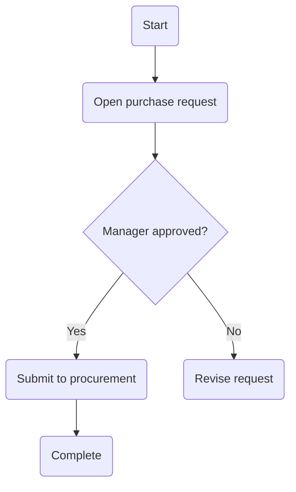

# PRD_M08_Screen_Record_To_SOP

AI Knowledge Transfer System

Product Requirement Document

Module: M08
Module Name: Screen Record To SOP
Version: v1.0.0
Owner: Product Manager
Last Update: 2026-06-25

## 1. Vision

M08 Screen Record To SOP turns screen recordings into structured operational knowledge.

Users record an operation once, and AI generates:

- SOP
- Flowchart
- FAQ
- Course
- Quiz
- AI Mentor content

The goal is to reduce manual SOP writing and preserve operational knowledge from real workflows.

## 2. Business Problems

The module addresses:

- Teams do not write SOPs consistently.
- SOP creation is slow and manual.
- Expert operations are not captured visually.
- ERP and internal system workflows are hard to explain with text only.
- New employees need visual process guidance.
- Employee turnover causes workflow knowledge loss.

## 3. Objectives

- Convert screen recordings into SOP drafts.
- Generate process flowcharts automatically.
- Generate FAQ from recorded operations.
- Generate training content from workflow recordings.
- Provide AI Mentor support based on generated SOP knowledge.

## 4. Workflow

```text
Screen Recording
↓
Video Upload
↓
Frame Extraction
↓
OCR
↓
UI Detection
↓
Action Detection
↓
Step Detection
↓
AI Summary
↓
SOP Generation
↓
Flowchart
↓
FAQ
↓
Training Course
↓
Publish
```

## 5. User Story

### Story 1: Procurement Specialist Records Purchase Workflow

User records a purchase workflow:

```text
Open purchase request
↓
Manager approval
↓
Submit to procurement
↓
Complete workflow
```

AI generates:

- SOP
- Flowchart
- FAQ
- Training material

### Story 2: HR Creates Onboarding SOP

HR records the onboarding process, and AI generates an onboarding SOP.

### Story 3: IT Records ERP Operation

IT records an ERP operation, and AI generates system operation guidance.

## 6. Input Sources

Supported screen recording formats:

```text
mp4
mov
avi
mkv
webm
```

Supported resolution:

```text
720P
1080P
2K
4K
```

## 7. Video Processing

```text
Video
↓
Frame Extraction
↓
1 FPS or Adaptive FPS
↓
Image Frames
```

Metadata:

```text
timestamp
frame_id
screen_size
duration
```

## 8. OCR Engine

Detected UI text and elements:

```text
button
menu
table
input
dialog
form
title
```

Supported OCR engines:

```text
PaddleOCR
Tesseract
EasyOCR
```

## 9. UI Detection

Detected UI components:

```text
Click Button
Dropdown
Textbox
Checkbox
Tab
Dialog
Menu
Grid
```

Example:

```text
Click: Create purchase request
Input: supplier
Input: item
Click: Submit
```

## 10. Action Detection

Detected actions:

```text
mouse click
typing
scroll
drag
select
double click
shortcut key
```

Output example:

```text
Step 1
Click: Create purchase request

Step 2
Input: supplier

Step 3
Click: Submit
```

## 11. Step Detection

Step types:

```text
start
action
decision
exception
end
```

Example:

```text
Start
↓
Open purchase request
↓
Manager approval?
↓
Yes
↓
Submit to procurement
↓
Complete
```

## 12. SOP Generation

SOP output sections:

```text
Purpose
Scope
Role
Procedure
Decision
Exception
FAQ
Reference
Revision
```

## 13. SOP Example

```text
Step 1
Open purchase request.
Responsible: Employee

Step 2
Manager approval.
Responsible: Manager

Step 3
Submit to procurement.
Responsible: Procurement
```

## 14. Flowchart Generation

Output:

```text
Mermaid
```

Example:



## 15. Screenshot Capture

Each step should store:

```text
screenshot
step
description
highlight_area
```

Example:

```text
Step 1
Screenshot shows the Create purchase request button highlighted.
```

## 16. FAQ Generation

AI-generated question examples:

```text
Q: What should I do if manager approval is rejected?
Q: What should I do if supplier delivery is delayed?
Q: What should I do if required data is missing?
```

AI answers should cite the generated SOP.

## 17. Course Generation

AI-generated training content:

```text
Course
Lesson
Quiz
Flash Card
Mentor
```

Example:

```text
Lesson 1: Open purchase request
Lesson 2: Manager approval

Quiz:
What is the first step in the purchase workflow?
```

## 18. AI Mentor

Example:

```text
Learner: What should I do if manager approval is rejected?

AI:
Review the purchase SOP and revise the request according to the rejection comment.
```

Citation fields:

```text
SOP
Page
Step
Confidence
```

## 19. Screen Annotation

Supported annotations:

```text
Arrow
Highlight
Red Box
Step Number
Tooltip
```

## 20. Browser Recording

Supported browsers:

```text
Chrome
Edge
Firefox
```

Supported web systems:

```text
ERP
CRM
HR
Email
Web System
```

## 21. Desktop Recording

Supported operating systems:

```text
Windows
Mac
Linux
```

Supported desktop systems:

```text
ERP Client
Excel
Word
Legacy System
```

## 22. Timeline

Timeline example:

```text
00:00 Start
00:10 Open purchase request
00:25 Manager approval
00:40 Complete
```

## 23. Human Review

```text
AI Draft
↓
Reviewer
↓
Edit
↓
Approve
↓
Publish
```

## 24. Integration

- M01 Documents
- M02 AI QA
- M04 SOP
- M05 Training
- M06 Agent

## 25. Dashboard

Dashboard cards:

```text
Recorded Videos
Generated SOP
Generated FAQ
Generated Courses
AI Accuracy
Review Pending
Published SOP
```

## 26. KPI

```text
Step Detection > 90%
OCR > 95%
Flowchart > 90%
SOP Accuracy > 85%
FAQ Accuracy > 85%
Training Completion > 90%
```

## 27. Future Features

```text
Live Recording
Real Time SOP
Browser Extension
Video QA
Avatar Teacher
Voice Guide
Process Mining
Auto Workflow Discovery
```

## 28. Competitive Advantage

Traditional approach:

```text
Record screen
↓
Human writes SOP manually
```

M08 approach:

```text
Record screen
↓
AI understands workflow
↓
AI generates SOP
↓
AI generates flowchart
↓
AI generates training
↓
AI Mentor supports learners
```

## 29. Final Goal

M08 should evolve from a screen recording feature into an AI Process Mining Platform.

Flow:

```text
User
↓
Record Once
↓
AI Understand
↓
SOP Forever
↓
Training Forever
↓
Knowledge Forever
```

The final goal is to transform real operations into durable process knowledge.
