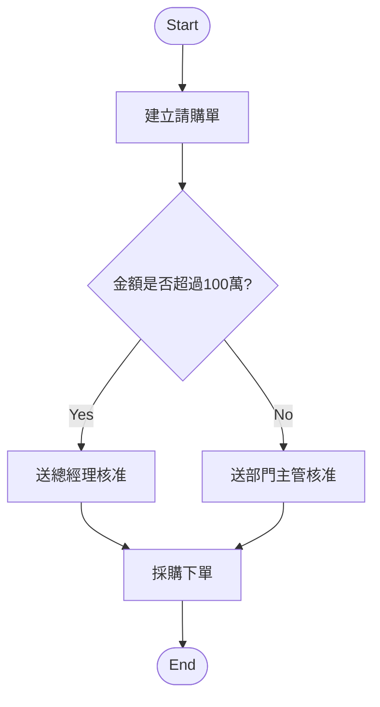

# M04_SOP_Generation_Engine

AI Knowledge Transfer System

Module Specification

Module : M04

Module Name : SOP Generator

Engine : SOP Generation Engine

Version : v1.0.0

Owner : System Architect

Last Update : 2026-06-25

---

# 1. Purpose

本文件定義 M04 SOP Generator 的核心 AI 產生引擎。

此引擎負責將：

* 文件
* 經驗紀錄
* 會議逐字稿
* FAQ
* Case Study
* Email
* 人工輸入內容

轉換成：

* 標準 SOP
* 流程圖
* FAQ
* 教學教材
* 測驗題
* 版本紀錄
* 可供 AI QA 與 Agent 使用的結構化知識

---

# 2. Engine Overview

```text
Input Sources
↓
Content Normalization
↓
Process Detection
↓
Step Extraction
↓
Role Extraction
↓
Decision Point Detection
↓
Exception Flow Detection
↓
SOP Draft Generation
↓
Flowchart Generation
↓
FAQ Generation
↓
Training Material Generation
↓
Human Review
↓
Publish
↓
RAG Index
```

---

# 3. Input Sources

支援來源：

```text
M01 documents
M03 experience_records
knowledge_items
meeting_transcripts
faq
case_studies
manual_input
email_threads
screen_recording_transcript
video_transcript
```

---

# 4. Input Requirements

每次產生 SOP 至少需要：

```text
title
department_id
sop_type
input_sources
target_audience
permission_scope
language
```

選填：

```text
existing_sop_id
business_rules
approval_rules
role_mapping
risk_notes
reference_documents
```

---

# 5. SOP Types

支援 SOP 類型：

```text
operation_sop
maintenance_sop
procurement_sop
hr_sop
finance_sop
audit_sop
training_sop
customer_service_sop
it_sop
quality_control_sop
```

---

# 6. Content Normalization

不同來源需先轉成統一格式。

## 6.1 Normalized Content Schema

```json
{
  "source_id": "uuid",
  "source_type": "document | experience | meeting | faq | case | email | manual",
  "title": "source title",
  "content": "clean text",
  "metadata": {
    "department_id": "uuid",
    "author": "string",
    "created_at": "timestamp",
    "permission_scope": "department",
    "language": "zh-TW"
  }
}
```

---

# 7. Process Detection

AI 需判斷內容是否包含可轉換成 SOP 的流程。

## 7.1 Detection Criteria

```text
has_steps
has_roles
has_decisions
has_inputs
has_outputs
has_exception_cases
has_repeated_operation
```

---

## 7.2 Output

```json
{
  "is_sop_candidate": true,
  "confidence_score": 0.91,
  "detected_process_name": "請購流程",
  "reason": "內容包含明確步驟、角色、簽核節點與例外處理。"
}
```

---

# 8. Step Extraction

AI 需抽取流程步驟。

## 8.1 Step Fields

```text
step_id
step_order
step_title
description
responsible_role
input_data
output_data
system_used
estimated_time
required_documents
risk_notes
```

---

## 8.2 Step Example

```json
{
  "step_order": 1,
  "step_title": "建立請購單",
  "description": "申請人登入 ERP 系統並填寫請購資料。",
  "responsible_role": "Employee",
  "input_data": ["需求品項", "數量", "預算代碼"],
  "output_data": ["請購單"],
  "system_used": ["ERP"],
  "estimated_time": "10 minutes",
  "required_documents": ["報價單"],
  "risk_notes": ["品項與數量需確認正確"]
}
```

---

# 9. Role Extraction

AI 需識別 SOP 中的角色。

## 9.1 Common Roles

```text
Employee
Department Manager
Procurement
Finance
HR
IT
Quality Control
Warehouse
Supplier
Customer
Administrator
```

---

## 9.2 Role Output

```json
{
  "role": "Department Manager",
  "responsibilities": [
    "審核請購單",
    "確認預算",
    "退回錯誤申請"
  ]
}
```

---

# 10. Decision Point Detection

AI 需找出決策點。

## 10.1 Example

```text
請購金額是否超過 100 萬？
```

---

## 10.2 Decision Fields

```text
decision_id
question
condition
yes_action
no_action
responsible_role
risk_level
```

---

## 10.3 Decision Output Example

```json
{
  "question": "請購金額是否超過 100 萬？",
  "condition": "amount > 1000000",
  "yes_action": "送總經理核准",
  "no_action": "送部門主管核准",
  "responsible_role": "Department Manager",
  "risk_level": "medium"
}
```

---

# 11. Exception Flow Detection

AI 需找出例外流程。

## 11.1 Exception Examples

```text
主管退回
供應商缺貨
資料填寫錯誤
系統異常
審核逾期
客戶急單
設備故障
```

---

## 11.2 Exception Fields

```text
exception_id
trigger_condition
description
handling_steps
responsible_role
escalation_rule
```

---

# 12. SOP Draft Generation

SOP 草稿必須包含以下結構：

```text
1. Purpose
2. Scope
3. Definitions
4. Roles and Responsibilities
5. Procedure
6. Decision Rules
7. Exception Handling
8. Required Forms / Documents
9. System Usage
10. Risk and Control Points
11. FAQ
12. References
13. Revision History
```

---

# 13. SOP Output Schema

```json
{
  "title": "請購流程 SOP",
  "department_id": "uuid",
  "sop_type": "procurement_sop",
  "purpose": "規範企業內部請購流程。",
  "scope": "適用於所有部門之採購申請。",
  "roles": [],
  "steps": [],
  "decisions": [],
  "exceptions": [],
  "faq": [],
  "references": [],
  "revision_history": []
}
```

---

# 14. Flowchart Generation

引擎需產生 Mermaid Flowchart。

## 14.1 Flowchart Rule

```text
Start node
Step node
Decision node
Exception node
End node
```

---

## 14.2 Mermaid Example



---

# 15. FAQ Generation

AI 需從 SOP 自動產生 FAQ。

## 15.1 FAQ Output

```json
[
  {
    "question": "請購流程第一步是什麼？",
    "answer": "第一步是由申請人建立請購單。",
    "source_step": "step_001"
  },
  {
    "question": "請購金額超過100萬怎麼辦？",
    "answer": "需送總經理核准。",
    "source_decision": "decision_001"
  }
]
```

---

# 16. Training Material Generation

AI 需自動產生新人教育內容。

## 16.1 Training Output

```text
summary
learning_objectives
lesson_outline
quiz
flash_cards
common_mistakes
```

---

## 16.2 Quiz Example

```json
{
  "question": "請購流程的第一步是什麼？",
  "options": [
    "採購下單",
    "建立請購單",
    "驗收入庫",
    "付款"
  ],
  "answer": "建立請購單",
  "explanation": "申請人需先建立請購單，才能進入主管簽核。"
}
```

---

# 17. Quality Validation

AI 產出 SOP 後需檢查：

```text
has_purpose
has_scope
has_roles
has_steps
has_decisions
has_exceptions
has_faq
has_references
has_revision_history
```

---

## 17.1 Quality Score

```text
0~100
```

分數規則：

```text
90~100: Ready for review
70~89: Needs improvement
0~69: Not acceptable
```

---

# 18. Citation Mapping

每個 SOP 步驟需盡量對應來源。

## 18.1 Citation Fields

```text
source_type
source_id
source_title
page_number
chunk_id
quote_text
confidence_score
```

---

# 19. Human Review

所有 AI 產生 SOP 必須經過人工審核。

流程：

```text
AI Draft
↓
Reviewer Edit
↓
Quality Check
↓
Approve
↓
Publish
```

---

# 20. Version Control

每次發布 SOP 需產生版本。

```text
v1.0
v1.1
v1.2
v2.0
```

保存：

```text
version_no
created_by
change_note
diff_summary
created_at
```

---

# 21. Version Compare

支援比較：

```text
added_steps
removed_steps
changed_steps
changed_roles
changed_decisions
changed_exceptions
```

---

# 22. Auto Update Detection

當來源文件或經驗更新時，系統需檢查 SOP 是否過期。

## 22.1 Trigger

```text
source_document_updated
experience_updated
faq_updated
case_updated
policy_updated
```

---

## 22.2 Output

```json
{
  "sop_id": "uuid",
  "update_required": true,
  "reason": "來源文件採購規範 v2.0 已更新，影響步驟 3。",
  "affected_steps": ["step_003"]
}
```

---

# 23. Background Jobs

Queue：

```text
Redis + Celery
```

Jobs：

```text
sop_candidate_detection_job
sop_step_extraction_job
sop_role_extraction_job
sop_decision_extraction_job
sop_exception_extraction_job
sop_draft_generation_job
sop_flowchart_generation_job
sop_faq_generation_job
sop_training_generation_job
sop_quality_validation_job
sop_embedding_job
sop_publish_job
```

---

# 24. Error Handling

Error Codes：

```text
SOP_INPUT_EMPTY
SOP_NOT_CANDIDATE
SOP_STEP_EXTRACTION_FAILED
SOP_DECISION_EXTRACTION_FAILED
SOP_FLOWCHART_FAILED
SOP_FAQ_FAILED
SOP_QUIZ_FAILED
SOP_QUALITY_TOO_LOW
SOP_REVIEW_REQUIRED
SOP_PUBLISH_FAILED
```

---

# 25. Security

必須支援：

```text
JWT
RBAC
Department Isolation
Permission Scope
Audit Log
Sensitive Data Masking
Version Lock
Approval Required
```

---

# 26. Audit Log

需紀錄：

```text
generate_sop
edit_sop
approve_sop
publish_sop
rollback_sop
compare_sop_version
delete_sop
export_sop
```

---

# 27. Integration

## 27.1 M01 Document Center

使用文件作為 SOP 來源。

---

## 27.2 M03 Experience Transfer

使用經驗、案例、FAQ 作為 SOP 來源。

---

## 27.3 M02 AI QA Assistant

AI QA 可引用 SOP。

---

## 27.4 M05 Training Center

SOP 可轉訓練教材。

---

## 27.5 M06 AI Agent

Agent 可依 SOP 執行任務建議。

---

# 28. Success KPI

```text
SOP Generation Success Rate > 95%
SOP Quality Score > 85
Flowchart Generation Success Rate > 90%
FAQ Generation Accuracy > 85%
Training Material Completion > 90%
Review Approval Rate > 80%
Citation Coverage > 90%
```

---

# 29. Future Enhancements

```text
Screen Recording To SOP
Video To SOP
Browser Action To SOP
AI Process Mining
SOP Simulation
Agent Execution Checklist
Knowledge Graph SOP
Auto SOP Refactoring
```

---

# 30. Final Goal

M04 SOP Generation Engine 的最終目標不是：

AI 幫忙寫文件

而是：

```text
Raw Knowledge
↓
Structured Workflow
↓
Standard SOP
↓
Training Material
↓
AI QA
↓
AI Agent
↓
Enterprise Operating System
```

讓企業流程能被保存、查詢、教學、審核、更新，並逐步成為 AI Agent 可理解與協作的標準作業核心。
