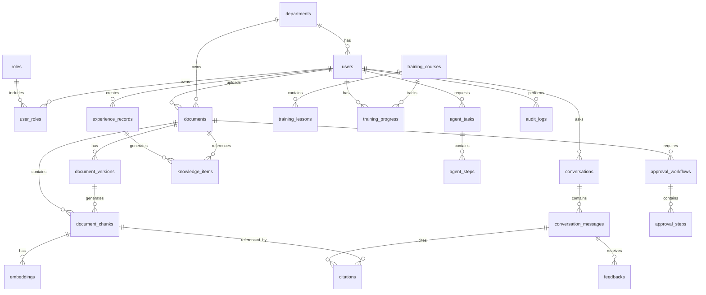

# AI Knowledge Transfer System (KTS)

## ERD v1

Version: v1.0.0
Document Type: ERD Specification
Author: Project Manager / System Architect
Last Updated: 2026-06-25

---

# 1. ERD Goal

本文件定義 AI Knowledge Transfer System 第一版資料庫結構。

v1 主要支援：

* 使用者管理
* 部門管理
* 角色權限
* 文件知識庫
* 文件版本
* 文件切塊 Chunk
* Embedding 向量資料
* AI 問答紀錄
* 引用來源 Citation
* 使用者回饋 Feedback
* 稽核紀錄 Audit Log
* 教育訓練
* AI Agent 任務紀錄
* 知識治理

---

# 2. Core Entity Groups

系統資料表分為 8 大群組：

```text
1. Identity & Access
2. Organization
3. Knowledge Document
4. RAG & AI QA
5. Experience Transfer
6. Training
7. Agent
8. Governance & Audit
```

---

# 3. Mermaid ERD



---

# 4. Table Definitions

---

# 4.1 departments

## Purpose

管理企業部門。

## Fields

| Field      | Type      | Description       |
| ---------- | --------- | ----------------- |
| id         | UUID      | Primary Key       |
| name       | VARCHAR   | 部門名稱              |
| code       | VARCHAR   | 部門代碼              |
| parent_id  | UUID      | 上層部門              |
| status     | VARCHAR   | active / inactive |
| created_at | TIMESTAMP | 建立時間              |
| updated_at | TIMESTAMP | 更新時間              |

---

# 4.2 users

## Purpose

系統使用者。

## Fields

| Field         | Type      | Description                   |
| ------------- | --------- | ----------------------------- |
| id            | UUID      | Primary Key                   |
| department_id | UUID      | FK departments.id             |
| name          | VARCHAR   | 使用者姓名                         |
| email         | VARCHAR   | Email                         |
| password_hash | VARCHAR   | 密碼雜湊                          |
| job_title     | VARCHAR   | 職稱                            |
| status        | VARCHAR   | active / inactive / suspended |
| last_login_at | TIMESTAMP | 最後登入時間                        |
| created_at    | TIMESTAMP | 建立時間                          |
| updated_at    | TIMESTAMP | 更新時間                          |

---

# 4.3 roles

## Purpose

角色表。

## Default Roles

* Employee
* Department Manager
* Administrator
* Auditor

## Fields

| Field       | Type      | Description |
| ----------- | --------- | ----------- |
| id          | UUID      | Primary Key |
| name        | VARCHAR   | 角色名稱        |
| description | TEXT      | 說明          |
| created_at  | TIMESTAMP | 建立時間        |
| updated_at  | TIMESTAMP | 更新時間        |

---

# 4.4 user_roles

## Purpose

使用者與角色多對多關聯。

## Fields

| Field      | Type      | Description |
| ---------- | --------- | ----------- |
| id         | UUID      | Primary Key |
| user_id    | UUID      | FK users.id |
| role_id    | UUID      | FK roles.id |
| created_at | TIMESTAMP | 建立時間        |

---

# 4.5 documents

## Purpose

文件主檔。

## Fields

| Field            | Type      | Description                                                 |
| ---------------- | --------- | ----------------------------------------------------------- |
| id               | UUID      | Primary Key                                                 |
| department_id    | UUID      | FK departments.id                                           |
| uploaded_by      | UUID      | FK users.id                                                 |
| title            | VARCHAR   | 文件標題                                                        |
| description      | TEXT      | 文件描述                                                        |
| file_type        | VARCHAR   | pdf / docx / xlsx / pptx / image / audio / video / markdown |
| storage_path     | VARCHAR   | MinIO / Object Storage 路徑                                   |
| permission_scope | VARCHAR   | public / department / private / confidential / admin_only   |
| status           | VARCHAR   | draft / processing / published / archived / rejected        |
| current_version  | VARCHAR   | 當前版本                                                        |
| created_at       | TIMESTAMP | 建立時間                                                        |
| updated_at       | TIMESTAMP | 更新時間                                                        |

---

# 4.6 document_versions

## Purpose

文件版本管理。

## Fields

| Field        | Type      | Description     |
| ------------ | --------- | --------------- |
| id           | UUID      | Primary Key     |
| document_id  | UUID      | FK documents.id |
| version_no   | VARCHAR   | v1.0.0          |
| file_hash    | VARCHAR   | 檔案雜湊            |
| storage_path | VARCHAR   | 版本檔案路徑          |
| change_note  | TEXT      | 版本說明            |
| created_by   | UUID      | FK users.id     |
| created_at   | TIMESTAMP | 建立時間            |

---

# 4.7 document_chunks

## Purpose

RAG 文件切塊資料。

## Fields

| Field               | Type      | Description             |
| ------------------- | --------- | ----------------------- |
| id                  | UUID      | Primary Key             |
| document_id         | UUID      | FK documents.id         |
| document_version_id | UUID      | FK document_versions.id |
| chunk_index         | INTEGER   | Chunk 順序                |
| title               | VARCHAR   | Chunk 標題                |
| section             | VARCHAR   | 文件段落                    |
| page_number         | INTEGER   | 頁碼                      |
| content             | TEXT      | Chunk 內容                |
| token_count         | INTEGER   | Token 數                 |
| metadata            | JSONB     | 額外 metadata             |
| created_at          | TIMESTAMP | 建立時間                    |

---

# 4.8 embeddings

## Purpose

向量資料表。

## Fields

| Field           | Type      | Description           |
| --------------- | --------- | --------------------- |
| id              | UUID      | Primary Key           |
| chunk_id        | UUID      | FK document_chunks.id |
| embedding_model | VARCHAR   | embedding model name  |
| vector          | VECTOR    | pgvector 欄位           |
| dimension       | INTEGER   | 向量維度                  |
| created_at      | TIMESTAMP | 建立時間                  |

---

# 4.9 conversations

## Purpose

AI 問答對話主檔。

## Fields

| Field      | Type      | Description         |
| ---------- | --------- | ------------------- |
| id         | UUID      | Primary Key         |
| user_id    | UUID      | FK users.id         |
| title      | VARCHAR   | 對話標題                |
| channel    | VARCHAR   | web / mobile / line |
| created_at | TIMESTAMP | 建立時間                |
| updated_at | TIMESTAMP | 更新時間                |

---

# 4.10 conversation_messages

## Purpose

AI 對話訊息。

## Fields

| Field            | Type      | Description               |
| ---------------- | --------- | ------------------------- |
| id               | UUID      | Primary Key               |
| conversation_id  | UUID      | FK conversations.id       |
| sender_type      | VARCHAR   | user / assistant / system |
| message          | TEXT      | 訊息內容                      |
| model_name       | VARCHAR   | 使用模型                      |
| token_usage      | INTEGER   | Token 用量                  |
| confidence_score | DECIMAL   | 信心分數                      |
| created_at       | TIMESTAMP | 建立時間                      |

---

# 4.11 citations

## Purpose

AI 回答引用來源。

## Fields

| Field           | Type      | Description                 |
| --------------- | --------- | --------------------------- |
| id              | UUID      | Primary Key                 |
| message_id      | UUID      | FK conversation_messages.id |
| chunk_id        | UUID      | FK document_chunks.id       |
| document_id     | UUID      | FK documents.id             |
| page_number     | INTEGER   | 引用頁碼                        |
| quote_text      | TEXT      | 引用文字                        |
| relevance_score | DECIMAL   | 關聯分數                        |
| created_at      | TIMESTAMP | 建立時間                        |

---

# 4.12 feedbacks

## Purpose

使用者對 AI 回答的回饋。

## Fields

| Field         | Type      | Description                           |
| ------------- | --------- | ------------------------------------- |
| id            | UUID      | Primary Key                           |
| message_id    | UUID      | FK conversation_messages.id           |
| user_id       | UUID      | FK users.id                           |
| rating        | INTEGER   | 1-5                                   |
| feedback_type | VARCHAR   | helpful / wrong / incomplete / unsafe |
| comment       | TEXT      | 使用者意見                                 |
| created_at    | TIMESTAMP | 建立時間                                  |

---

# 4.13 experience_records

## Purpose

老員工經驗、訪談、錄音、筆記。

## Fields

| Field            | Type      | Description                                |
| ---------------- | --------- | ------------------------------------------ |
| id               | UUID      | Primary Key                                |
| created_by       | UUID      | FK users.id                                |
| department_id    | UUID      | FK departments.id                          |
| title            | VARCHAR   | 經驗標題                                       |
| source_type      | VARCHAR   | audio / video / text / interview / meeting |
| raw_storage_path | VARCHAR   | 原始檔案路徑                                     |
| transcript       | TEXT      | 語音轉文字內容                                    |
| summary          | TEXT      | AI 摘要                                      |
| status           | VARCHAR   | draft / reviewed / published / archived    |
| created_at       | TIMESTAMP | 建立時間                                       |
| updated_at       | TIMESTAMP | 更新時間                                       |

---

# 4.14 knowledge_items

## Purpose

整理後的知識項目，例如 FAQ、SOP、經驗技巧。

## Fields

| Field                | Type      | Description                             |
| -------------------- | --------- | --------------------------------------- |
| id                   | UUID      | Primary Key                             |
| source_document_id   | UUID      | FK documents.id                         |
| source_experience_id | UUID      | FK experience_records.id                |
| department_id        | UUID      | FK departments.id                       |
| title                | VARCHAR   | 知識標題                                    |
| knowledge_type       | VARCHAR   | faq / sop / case / tip / policy         |
| question             | TEXT      | FAQ 問題                                  |
| answer               | TEXT      | FAQ 答案                                  |
| content              | TEXT      | 知識內容                                    |
| status               | VARCHAR   | draft / reviewed / published / archived |
| created_by           | UUID      | FK users.id                             |
| created_at           | TIMESTAMP | 建立時間                                    |
| updated_at           | TIMESTAMP | 更新時間                                    |

---

# 4.15 training_courses

## Purpose

教育訓練課程。

## Fields

| Field         | Type      | Description                  |
| ------------- | --------- | ---------------------------- |
| id            | UUID      | Primary Key                  |
| department_id | UUID      | FK departments.id            |
| title         | VARCHAR   | 課程名稱                         |
| description   | TEXT      | 課程說明                         |
| role_target   | VARCHAR   | 適用角色                         |
| status        | VARCHAR   | draft / published / archived |
| created_by    | UUID      | FK users.id                  |
| created_at    | TIMESTAMP | 建立時間                         |
| updated_at    | TIMESTAMP | 更新時間                         |

---

# 4.16 training_lessons

## Purpose

課程單元。

## Fields

| Field                 | Type      | Description            |
| --------------------- | --------- | ---------------------- |
| id                    | UUID      | Primary Key            |
| course_id             | UUID      | FK training_courses.id |
| title                 | VARCHAR   | 單元名稱                   |
| content               | TEXT      | 單元內容                   |
| lesson_order          | INTEGER   | 排序                     |
| reference_document_id | UUID      | FK documents.id        |
| created_at            | TIMESTAMP | 建立時間                   |

---

# 4.17 training_progress

## Purpose

使用者學習進度。

## Fields

| Field            | Type      | Description                           |
| ---------------- | --------- | ------------------------------------- |
| id               | UUID      | Primary Key                           |
| user_id          | UUID      | FK users.id                           |
| course_id        | UUID      | FK training_courses.id                |
| progress_percent | DECIMAL   | 進度百分比                                 |
| status           | VARCHAR   | not_started / in_progress / completed |
| score            | DECIMAL   | 測驗分數                                  |
| completed_at     | TIMESTAMP | 完成時間                                  |
| updated_at       | TIMESTAMP | 更新時間                                  |

---

# 4.18 agent_tasks

## Purpose

AI Agent 任務主檔。

## Fields

| Field        | Type      | Description                                            |
| ------------ | --------- | ------------------------------------------------------ |
| id           | UUID      | Primary Key                                            |
| requested_by | UUID      | FK users.id                                            |
| agent_type   | VARCHAR   | procurement / hr / it / training / offboarding / audit |
| task_title   | VARCHAR   | 任務標題                                                   |
| task_input   | TEXT      | 使用者輸入                                                  |
| task_output  | TEXT      | Agent 結果                                               |
| status       | VARCHAR   | pending / running / completed / failed / cancelled     |
| created_at   | TIMESTAMP | 建立時間                                                   |
| completed_at | TIMESTAMP | 完成時間                                                   |

---

# 4.19 agent_steps

## Purpose

AI Agent 執行步驟。

## Fields

| Field          | Type      | Description                                       |
| -------------- | --------- | ------------------------------------------------- |
| id             | UUID      | Primary Key                                       |
| task_id        | UUID      | FK agent_tasks.id                                 |
| step_order     | INTEGER   | 步驟順序                                              |
| action_type    | VARCHAR   | search / retrieve / analyze / generate / validate |
| input_payload  | JSONB     | 輸入                                                |
| output_payload | JSONB     | 輸出                                                |
| status         | VARCHAR   | pending / running / completed / failed            |
| created_at     | TIMESTAMP | 建立時間                                              |

---

# 4.20 approval_workflows

## Purpose

知識審核流程。

## Fields

| Field        | Type      | Description                               |
| ------------ | --------- | ----------------------------------------- |
| id           | UUID      | Primary Key                               |
| target_type  | VARCHAR   | document / knowledge_item / sop           |
| target_id    | UUID      | 目標資料 ID                                   |
| requested_by | UUID      | FK users.id                               |
| status       | VARCHAR   | pending / approved / rejected / cancelled |
| created_at   | TIMESTAMP | 建立時間                                      |
| updated_at   | TIMESTAMP | 更新時間                                      |

---

# 4.21 approval_steps

## Purpose

審核步驟。

## Fields

| Field       | Type      | Description                   |
| ----------- | --------- | ----------------------------- |
| id          | UUID      | Primary Key                   |
| workflow_id | UUID      | FK approval_workflows.id      |
| approver_id | UUID      | FK users.id                   |
| step_order  | INTEGER   | 審核順序                          |
| status      | VARCHAR   | pending / approved / rejected |
| comment     | TEXT      | 審核意見                          |
| reviewed_at | TIMESTAMP | 審核時間                          |

---

# 4.22 audit_logs

## Purpose

系統稽核紀錄。

## Fields

| Field       | Type      | Description |
| ----------- | --------- | ----------- |
| id          | UUID      | Primary Key |
| user_id     | UUID      | FK users.id |
| action      | VARCHAR   | 操作類型        |
| target_type | VARCHAR   | 操作目標類型      |
| target_id   | UUID      | 操作目標 ID     |
| ip_address  | VARCHAR   | IP          |
| user_agent  | TEXT      | User Agent  |
| metadata    | JSONB     | 額外資料        |
| created_at  | TIMESTAMP | 建立時間        |

---

# 5. Suggested Indexes

```sql
CREATE INDEX idx_users_department_id ON users(department_id);
CREATE INDEX idx_documents_department_id ON documents(department_id);
CREATE INDEX idx_documents_status ON documents(status);
CREATE INDEX idx_document_chunks_document_id ON document_chunks(document_id);
CREATE INDEX idx_conversations_user_id ON conversations(user_id);
CREATE INDEX idx_messages_conversation_id ON conversation_messages(conversation_id);
CREATE INDEX idx_citations_message_id ON citations(message_id);
CREATE INDEX idx_feedbacks_message_id ON feedbacks(message_id);
CREATE INDEX idx_audit_logs_user_id ON audit_logs(user_id);
CREATE INDEX idx_audit_logs_created_at ON audit_logs(created_at);
```

---

# 6. pgvector Index

```sql
CREATE INDEX idx_embeddings_vector
ON embeddings
USING ivfflat (vector vector_cosine_ops)
WITH (lists = 100);
```

---

# 7. v1 MVP Required Tables

v1.0 MVP 至少需要：

```text
departments
users
roles
user_roles
documents
document_versions
document_chunks
embeddings
conversations
conversation_messages
citations
feedbacks
audit_logs
```

---

# 8. Future Tables

v1.1 以後可增加：

```text
experience_records
knowledge_items
training_courses
training_lessons
training_progress
agent_tasks
agent_steps
approval_workflows
approval_steps
```

---

# 9. Design Principles

## 9.1 UUID First

所有主鍵使用 UUID。

---

## 9.2 Audit Ready

重要操作都需留下 audit log。

---

## 9.3 Permission Ready

文件與知識項目需要支援權限範圍。

---

## 9.4 RAG Ready

文件必須可切塊、可引用、可追溯來源。

---

## 9.5 Version Ready

文件與 SOP 必須可版本控管。

---

# 10. Next Step

本文件完成後，下一步建立：

```text
spec/API/API_v1.md
```

定義：

* Auth API
* Document API
* Search API
* AI QA API
* Feedback API
* Admin API
