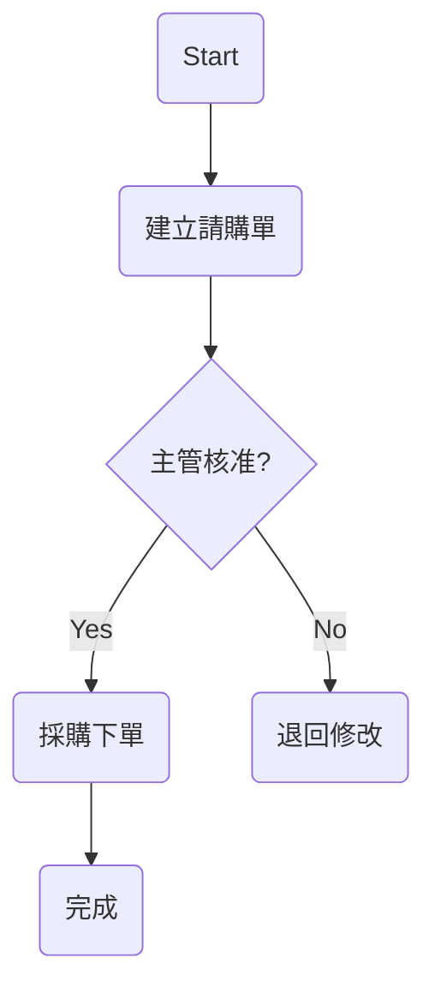

# PRD_M04_SOP_Generator

AI Knowledge Transfer System

Product Requirement Document

Module : M04

Module Name : SOP Generator

Version : v1.0.0

Owner : Product Manager

Last Update : 2026-06-25

---

# 1. Module Vision

建立企業 AI SOP Generator。

讓：

Document

*

Experience

*

Meeting

*

Case

*

FAQ

↓

AI分析

↓

自動建立

↓

SOP

↓

Flowchart

↓

Training Material

↓

Quiz

↓

AI Mentor

---

目的：

降低 SOP 撰寫成本

提升 SOP 品質

避免知識流失

建立企業標準流程。

---

# 2. Business Problems

企業常見問題：

---

SOP 散落

---

版本不一致

---

沒人願意寫 SOP

---

SOP 更新速度慢

---

新人看不懂 SOP

---

老師傅只有口頭交接

---

# 3. Module Objectives

Objective 1

AI 自動產生 SOP

---

Objective 2

AI 自動畫流程圖

---

Objective 3

AI 產生 FAQ

---

Objective 4

AI 產生教材

---

Objective 5

AI 持續更新 SOP

---

# 4. Input Sources

M01

Document Center

---

M03

Experience Transfer

---

Meeting Transcript

---

Email

---

Case Study

---

FAQ

---

Manual Input

---

# 5. SOP Generation Workflow

```text
Document

+

Experience

+

Meeting

↓

AI Analysis

↓

Step Detection

↓

Decision Point

↓

Exception Flow

↓

SOP Draft

↓

Flowchart

↓

FAQ

↓

Training Material

↓

Human Review

↓

Publish
```

---

# 6. User Stories

Story 1

老師傅錄音

↓

AI 自動建立 SOP

---

Story 2

設備維修案例

↓

AI 轉 SOP

---

Story 3

會議紀錄

↓

AI 整理作業流程

---

Story 4

新人

↓

直接看 SOP

↓

AI Mentor 解釋

---

# 7. SOP Types

支援：

---

Operation SOP

操作流程

---

Maintenance SOP

設備維修

---

HR SOP

人資

---

Procurement SOP

採購

---

Finance SOP

財務

---

Audit SOP

ISO

---

Training SOP

教育訓練

---

# 8. Functional Requirements

FR001

Generate SOP

---

Input

```text
documents

experience

meeting

faq

case
```

---

Output

```text
sop

flowchart

summary

faq

quiz
```

---

FR002

Generate Flowchart

AI 自動建立：

```text
Start

↓

Step

↓

Decision

↓

Action

↓

End
```

---

FR003

Generate FAQ

Example

```text
Q

請購流程需要哪些文件？


A

請購單

主管簽核

供應商報價
```

---

FR004

Generate Training Material

產生：

---

Summary

---

Slides

---

Quiz

---

Flash Cards

---

# 9. SOP Structure

每份 SOP 必須包含：

---

Purpose

---

Scope

---

Role & Responsibility

---

Procedure

---

Exception Handling

---

FAQ

---

References

---

Revision History

---

# 10. Procedure Format

Example

```text
Step1

建立請購單

Responsible

Employee


Step2

主管簽核

Responsible

Manager


Step3

採購下單

Responsible

Procurement
```

---

# 11. Decision Flow

Example

```text
請購金額 > 100萬

↓

Yes

↓

部門主管

↓

總經理

↓

核准


No

↓

部門主管

↓

核准
```

---

# 12. Flowchart Generation

AI輸出：

Mermaid

---

Example



---

# 13. Exception Handling

Example

```text
供應商缺貨

↓

替代供應商

↓

重新報價

↓

主管確認
```

---

# 14. AI Summary

Example

```text
本 SOP 說明：

請購流程

包含：

建立請購單

主管簽核

採購下單

驗收入庫
```

---

# 15. FAQ Generation

AI 自動建立：

```text
Q

請購需要哪些文件？


Q

主管不在怎麼辦？


Q

供應商缺貨怎麼處理？
```

---

# 16. Training Material

AI 自動建立：

---

Summary

---

Slides

---

Quiz

---

Flash Card

---

Example

```text
Q

請購第一步？

A

建立請購單
```

---

# 17. Quiz Generation

Example

```text
Q1

請購第一步是？

A

建立請購單


Q2

主管簽核後？

A

採購下單
```

---

# 18. Version Control

支援：

```text
v1.0

v1.1

v1.2

v2.0
```

保存：

---

Change Note

---

Author

---

Date

---

Compare Version

---

Rollback

---

# 19. Approval Workflow

```text
AI Draft

↓

Department Review

↓

Edit

↓

Approve

↓

Publish
```

---

# 20. Permission

```text
public

department

private

confidential

admin_only
```

---

# 21. Search Integration

M02 AI QA

可以查：

---

SOP

---

Flowchart

---

FAQ

---

Training Material

---

Quiz

---

# 22. AI Mentor Integration

User：

```text
主管簽核流程？
```

↓

AI

↓

引用 SOP

↓

逐步解釋

↓

顯示流程圖

↓

推薦 FAQ

---

# 23. Dashboard

Total SOP

---

Pending Review

---

Published SOP

---

Top Viewed SOP

---

Training Completion

---

Quiz Accuracy

---

# 24. KPI

SOP Generate Success

> 95%

---

Review Completion

> 90%

---

Training Satisfaction

> 4.5

---

AI Citation Rate

> 95%

---

# 25. Future Features

Video To SOP

---

Screen Recording To SOP

---

Browser Action To SOP

---

AI Process Mining

---

AI Workflow Designer

---

Knowledge Graph SOP

---

# 26. Design Principles

AI First

---

Human Review Required

---

Version Control

---

Traceable Citation

---

Training Ready

---

Agent Ready

---

# 27. Final Goal

M04 不只是：

SOP Editor

也不是：

Word Template

而是：

Enterprise AI SOP Platform

具備：

AI Generate

AI Flowchart

AI FAQ

AI Training

AI Mentor

AI Update

成為企業標準流程的核心系統。
