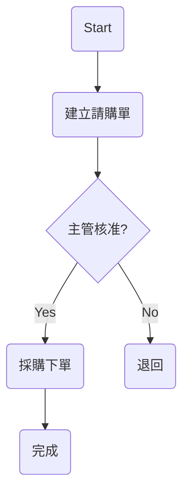

# PRD_M08_Screen_Record_To_SOP

AI Knowledge Transfer System

Product Requirement Document

Module : M08

Module Name : Screen Record To SOP

Version : v1.0.0

Owner : Product Manager

Last Update : 2026-06-25

---

# 1. Vision

建立：

AI Screen Record To SOP Platform

使用者：

不需要寫 SOP

不需要畫流程圖

不需要整理文件

只需要：

開始錄影

↓

完成工作

↓

AI 自動建立：

SOP

Flowchart

FAQ

Course

Quiz

AI Mentor

---

# 2. Business Problems

企業目前：

---

沒人寫 SOP

---

SOP 太難維護

---

老師傅只會操作

---

ERP 操作不容易文件化

---

新人只能跟著學

---

離職造成知識流失

---

# 3. Objectives

Objective 1

錄螢幕自動產生 SOP

---

Objective 2

自動畫流程圖

---

Objective 3

自動建立 FAQ

---

Objective 4

自動建立課程

---

Objective 5

成為 AI Mentor 的知識來源

---

# 4. Workflow

```text
Screen Recording

↓

Video Upload

↓

Frame Extraction

↓

OCR

↓

UI Detection

↓

Action Detection

↓

Step Detection

↓

AI Summary

↓

SOP Generation

↓

Flowchart

↓

FAQ

↓

Training Course

↓

Publish
```

---

# 5. User Story

Story 1

採購人員

↓

開始錄影

↓

建立請購單

↓

主管簽核

↓

採購下單

↓

停止錄影

---

AI：

↓

建立 SOP

↓

建立流程圖

↓

FAQ

↓

課程

---

Story 2

HR

↓

錄製新人報到流程

↓

AI建立 Onboarding SOP

---

Story 3

IT

↓

錄製ERP操作

↓

AI建立教材

---

# 6. Input Sources

Support：

```text
Screen Recording

mp4

mov

avi

mkv

webm
```

---

Resolution

```text
720P

1080P

2K

4K
```

---

# 7. Video Processing

```text
Video

↓

Frame Extraction

↓

1 FPS

or

Adaptive FPS

↓

Image Frames
```

---

Metadata

```text
timestamp

frame_id

screen_size

duration
```

---

# 8. OCR Engine

每張畫面：

AI辨識：

```text
button

menu

table

input

dialog

form

title
```

---

推薦：

```text
PaddleOCR

Tesseract

EasyOCR
```

---

# 9. UI Detection

辨識：

```text
Click Button

Dropdown

Textbox

Checkbox

Tab

Dialog

Menu

Grid
```

---

Example

```text
按下

建立請購單

↓

輸入

品名

↓

輸入

數量

↓

送出
```

---

# 10. Action Detection

AI分析：

```text
mouse click

typing

scroll

drag

select

double click

shortcut key
```

---

Output：

```text
Step1

Click

建立請購單

Step2

Input

品名

Step3

Click

送出
```

---

# 11. Step Detection

AI判斷：

```text
start

action

decision

exception

end
```

---

Example

```text
開始

↓

建立請購單

↓

主管簽核？

↓

Yes

↓

採購下單

↓

完成
```

---

# 12. SOP Generation

輸出：

```text
Purpose

Scope

Role

Procedure

Decision

Exception

FAQ

Reference

Revision
```

---

# 13. SOP Example

```text
Step1

建立請購單

Responsible

Employee


Step2

主管簽核

Responsible

Manager


Step3

採購下單

Responsible

Procurement
```

---

# 14. Flowchart Generation

輸出：

Mermaid

---

Example



---

# 15. Screenshot Capture

每個Step：

保存：

```text
screenshot

step

description

highlight_area
```

---

Example

```text
Step1

Screenshot

紅框：

建立請購單按鈕
```

---

# 16. FAQ Generation

AI：

```text
Q

主管不在怎麼辦？


Q

供應商缺貨？

Q

資料填錯？
```

---

AI回答：

引用 SOP。

---

# 17. Course Generation

AI建立：

```text
Course

Lesson

Quiz

Flash Card

Mentor
```

---

Example

```text
Lesson1

建立請購單


Lesson2

主管簽核


Quiz

請購第一步？
```

---

# 18. AI Mentor

新人：

```text
主管不在？

```

↓

AI：

```text
依照請購SOP

代理主管簽核

流程如下...
```

---

引用：

```text
SOP

Page

Step

Confidence
```

---

# 19. Screen Annotation

自動畫：

```text
Arrow

Highlight

Red Box

Step Number

Tooltip
```

---

# 20. Browser Recording

Support：

```text
Chrome

Edge

Firefox
```

---

Record：

```text
ERP

CRM

HR

Email

Web System
```

---

# 21. Desktop Recording

Support：

```text
Windows

Mac

Linux
```

---

Record：

```text
ERP Client

Excel

Word

Legacy System
```

---

# 22. Timeline

顯示：

```text
00:00

開始


00:10

建立請購單


00:25

主管簽核


00:40

完成
```

---

# 23. Human Review

AI Draft

↓

Reviewer

↓

Edit

↓

Approve

↓

Publish

---

# 24. Integration

M01

Documents

---

M02

AI QA

---

M04

SOP

---

M05

Training

---

M06

Agent

---

# 25. Dashboard

Cards：

```text
Recorded Videos

Generated SOP

Generated FAQ

Generated Courses

AI Accuracy

Review Pending

Published SOP
```

---

# 26. KPI

```text
Step Detection >90%

OCR >95%

Flowchart >90%

SOP Accuracy >85%

FAQ Accuracy >85%

Training Completion >90%
```

---

# 27. Future Features

```text
Live Recording

Real Time SOP

Browser Extension

Video QA

Avatar Teacher

Voice Guide

Process Mining

Auto Workflow Discovery
```

---

# 28. Competitive Advantage

傳統：

錄影

↓

人工寫SOP

---

M08：

錄影

↓

AI看懂

↓

AI寫SOP

↓

AI畫流程圖

↓

AI課程

↓

AI Mentor

---

# 29. Final Goal

M08

不是：

錄影工具

也不是：

螢幕錄製器

而是：

AI Process Mining Platform

讓：

User

↓

Record Once

↓

AI Understand

↓

SOP Forever

↓

Training Forever

↓

Knowledge Forever

成為企業流程數位化與知識轉移的核心平台。
