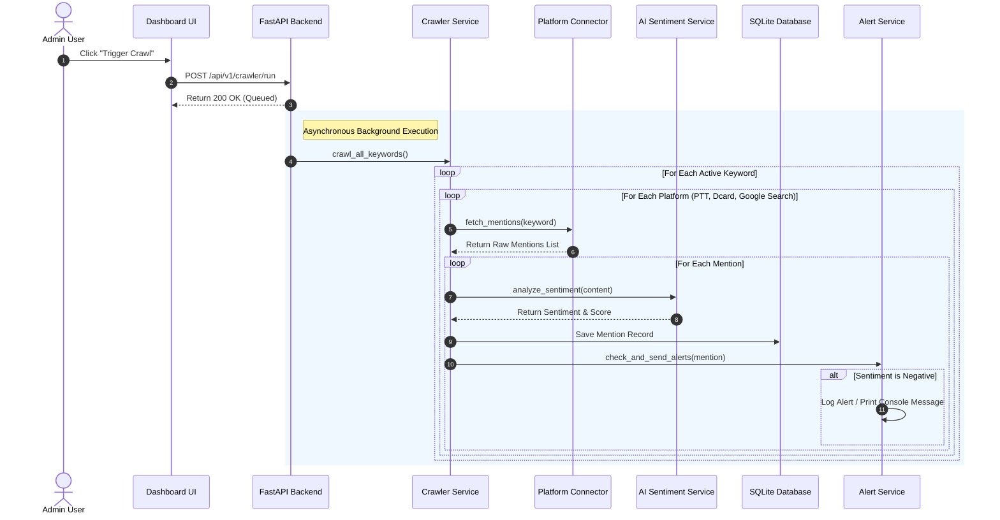
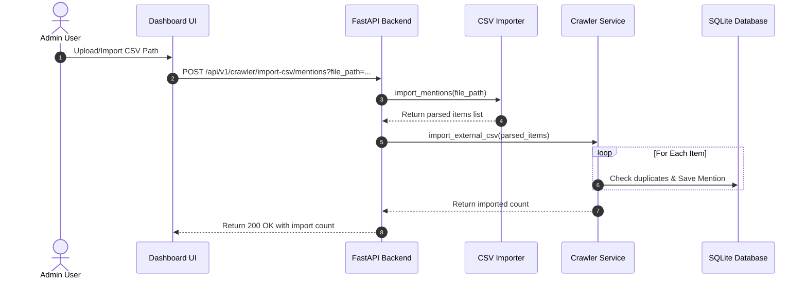

# Data Flow

This document details the flow of data within the **AI Reputation Risk Detection Platform** from data ingestion to user presentation.

## Keyword Crawling and Processing Flow

## CSV Offline File Importer Flow

