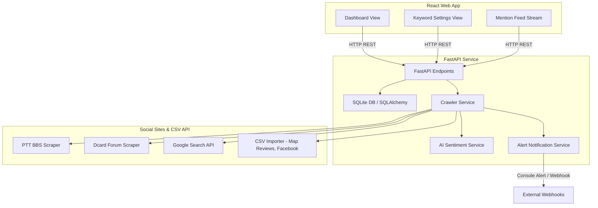

# System Architecture

This document describes the high-level architecture of the **AI Reputation Risk Detection Platform**.

## Architectural Components

### 1. Presentation Layer (Frontend)
- **Vite & React**: Compiles and runs the user interface.
- **Tailwind CSS**: A utility-first CSS library styled beautifully with custom dark mode colors (e.g., slate/indigo palettes).
- **TypeScript**: Ensures type safety on API models like Keyword, Mention, and stats.

### 2. Service Layer (Backend)
- **FastAPI**: Serves the REST API with auto-generated Swagger UI docs.
- **SQLAlchemy (ORM)**: Translates python objects into database records, pointing to a local SQLite database.
- **Pydantic**: Validates request parameters and shapes JSON responses.

### 3. Crawler & Connector Engine
- **Base Connector**: Defines interface routines.
- **Active Connectors**: Fetch data on PTT, Dcard, and Google Search.
- **Offline CSV Importers**: Ingest platform data (Google Maps review files or Facebook exports).

### 4. Analysis & Notification
- **AI Sentiment Service**: Evaluates content polarity (Positive, Neutral, Negative) and score mapping.
- **Alert Service**: Triggers warning thresholds (such as generating console alerts or system notifications on negative sentiments).
